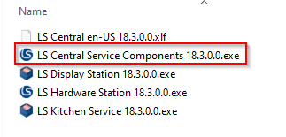
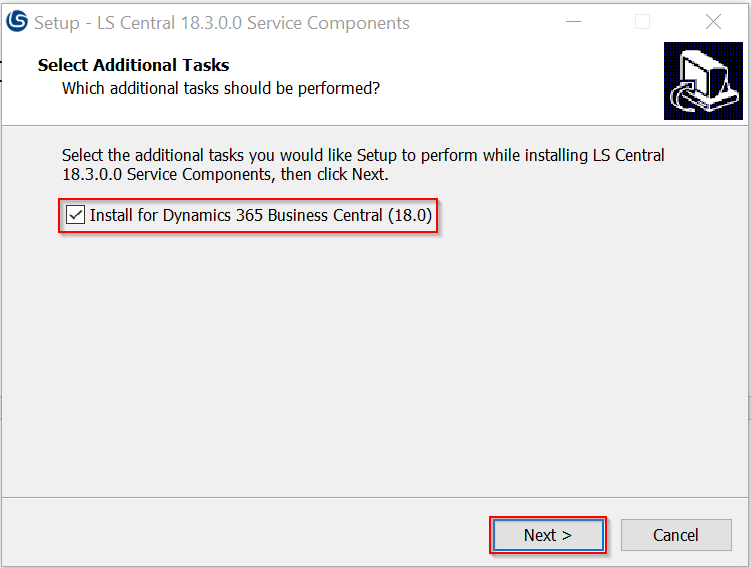
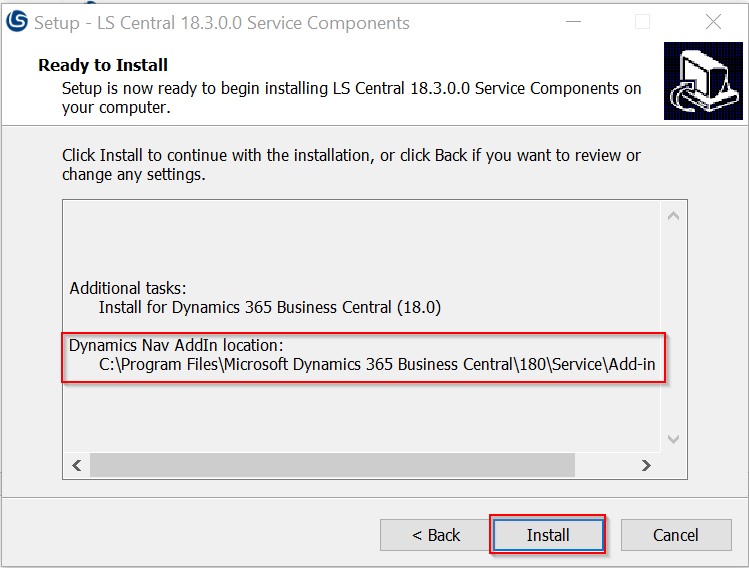
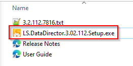
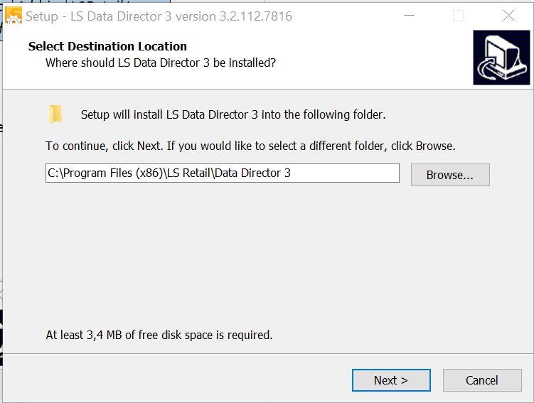
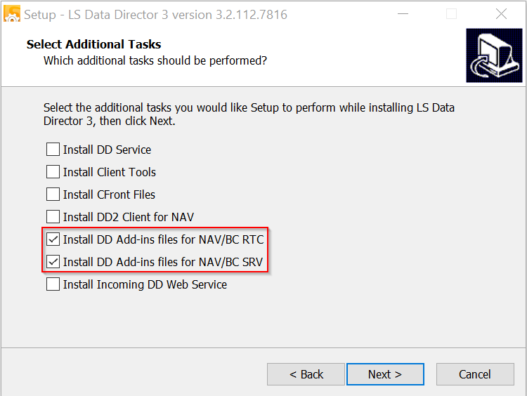
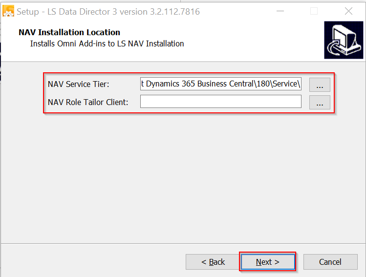
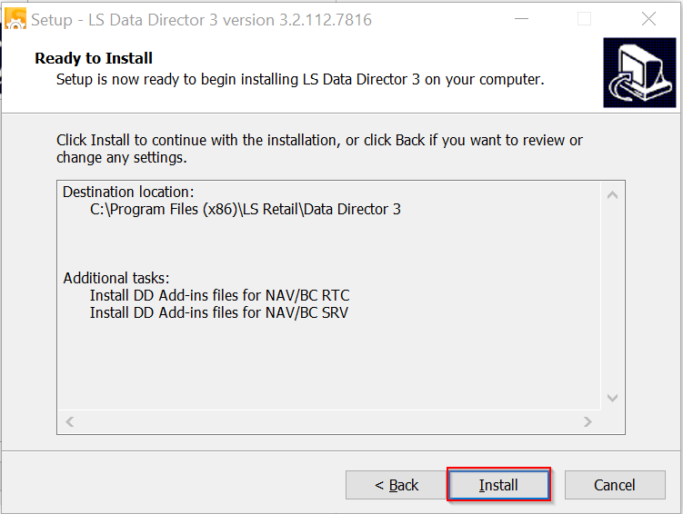
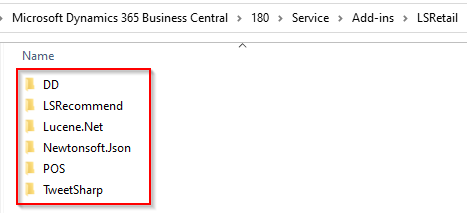

# Appendix

## Installation

### Docker

https://github.com/microsoft/navcontainerhelper/blob/master/NavContainerHelper.md#get-started--install-docker

[Prep Windows operating system containers | Microsoft Docs](https://docs.microsoft.com/en-us/virtualization/windowscontainers/quick-start/set-up-environment?tabs=Windows-Server)

### BCContainerHelper

https://github.com/microsoft/navcontainerhelper/blob/master/NavContainerHelper.md#get-started---install-navcontainerhelper

### LS Migration Tools

To install the LS Migration Tools Powershell module open a new Powershell console and enter:
```powershell
Install-Module LSMigrationTools
```

If the module is already installed, you can update it to make sure you’re using the latest version:
```powershell
Update-Module LSMigrationTools
```

### LS Central Service Components

For the LS Central Service Components, download the installation file from the LS Retail Partner Portal and run the executable file (LS Central Service Components `<version>`.exe).







> Please note that the add-ins will be installed in the default Business Central installation folder. If you have customized the installation folder, then you need to copy the LS Retail folder inside the Add-ins folder to the BC Service instance folder.
> Example:
> Copy from `C:\Program Files\Microsoft Dynamics 365 Business Central\210\Service\Add-ins\LSRetail` to `C:\Program Files\Microsoft Dynamics 365 Business Central\210_CU3\Service\Add-ins\LSRetail`

#### Data Director Client Tools

For the Data Director Client Tools, download the installation file from the LS Retail Partner Portal and run the executable file (LS.DataDirector.`<version>`.Setup.exe).







> For LS Central 15.0 or later, select the *Install DD Add-ins files for NAV/BC SRV* option only.



Indicate the folder(s) where the Data Director add-ins should be installed, if not using the default folders.



> List of add-ins installed for Business Central 18:
> 
