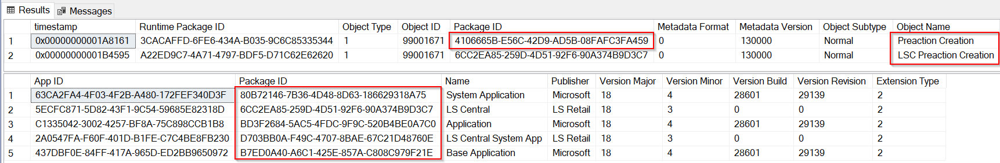
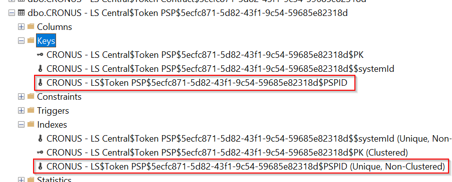
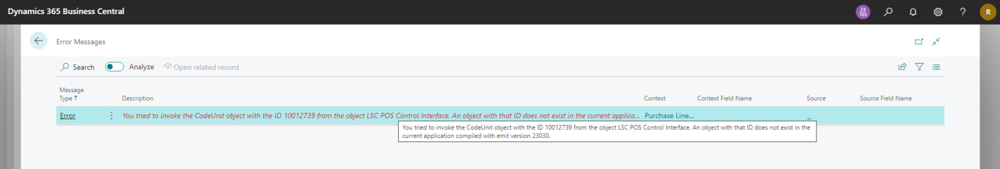
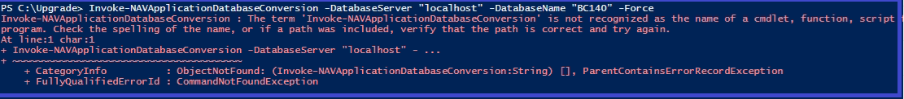

# Troubleshooting

## Table of Contents <!-- omit from toc -->

- [Troubleshooting](#troubleshooting)
  - [Error 1 - Start-NAVAppDataUpgrade : Could not upgrade the extension 'System Application'](#error-1---start-navappdataupgrade--could-not-upgrade-the-extension-system-application)
  - [Error 2](#error-2)
  - [Error 3](#error-3)
  - [Error 4](#error-4)
  - [Error 5](#error-5)
  - [Error 6 - User must be a member of the 'SUPER' group](#error-6---user-must-be-a-member-of-the-super-group)
  - [Error 7 - Error related to method ChangeNoStockPostingToNonInventoryType in LS Central Upgrade codeunit](#error-7---error-related-to-method-changenostockpostingtononinventorytype-in-ls-central-upgrade-codeunit)
  - [Error 8 - Unexisting codeunit object with emit version 23030](#error-8---unexisting-codeunit-object-with-emit-version-23030)
  - [Error 9 - The term 'Invoke-NAVApplicationDatabaseConversion' is not recognized as the name of a cmdlet, function, script or program](#error-9---the-term-invoke-navapplicationdatabaseconversion-is-not-recognized-as-the-name-of-a-cmdlet-function-script-or-program)

## Error 1 - Start-NAVAppDataUpgrade : Could not upgrade the extension 'System Application'

### Error Detail <!-- omit from toc -->

```powershell
When running the Start-NAVAppDataUpgrade cmdlet:
Start-NAVAppDataUpgrade -ServerInstance $toServerInstanceName -Name "System Application" -Version <version>
```

The following error can be shown:

```powershell
Start-NAVAppDataUpgrade : Could not upgrade the extension 'System Application' by 'Microsoft' from version '15.4.41023.41345' to '18.4.28601.29139' for tenant 'default' and company 'CRONUS - LS Central' due to the following error: 'The following SQL error occurred after the SQL command was canceled:
Invalid object name 'ls-w1-15-3-upg.dbo.CRONUS - LS Central$Preaction Creation$5ecfc871-5d82-43f1-9c54-59685e82318d'.
Statement(s) could not be prepared.
' and AL stack trace:
"Actions Management"(CodeUnit 99001451).IsLSRecord line 4 - LS Central by LS Retail
"Actions Management"(CodeUnit 99001451).IsValidForPreActionOnAfterGetDatabaseTableTriggerSetup line 5 - LS Central by LS Retail
GlobalTriggerManagement(CodeUnit 49).OnAfterGetDatabaseTableTriggerSetup line 2 - Base Application by Microsoft
GlobalTriggerManagement(CodeUnit 49).GetDatabaseTableTriggerSetup line 7 - Base Application by Microsoft
""Global Triggers""(CodeUnit 2000000002).GetDatabaseTableTriggerSetup line 2
"Retention Policy Log Impl."(CodeUnit 3909).CreateLogEntry - System Application by Microsoft
"Retention Policy Log Impl."(CodeUnit 3909).CreateTempLogEntry - System Application by Microsoft
"Retention Policy Log Impl."(CodeUnit 3909).LogInfo - System Application by Microsoft
"Retention Policy Log"(CodeUnit 3908).LogInfo - System Application by Microsoft
"Reten. Pol. Allowed Tbl. Impl."(CodeUnit 3906).AllowAddtoAllowedList - System Application by Microsoft
"Reten. Pol. Allowed Tbl. Impl."(CodeUnit 3906).OnVerifyAddtoAllowedList - System Application by Microsoft
"Reten. Pol. Allowed Tbl. Impl."(CodeUnit 3906).VerifyInsertAllowed - System Application by Microsoft
"Reten. Pol. Allowed Tables"(CodeUnit 3905).VerifyInsertAllowed - System Application by Microsoft
"Reten. Pol. Allowed Tbl. Impl."(CodeUnit 3906).AddToAllowedTables - System Application by Microsoft
"Reten. Pol. Allowed Tbl. Impl."(CodeUnit 3906).AddToAllowedTables - System Application by Microsoft
"Reten. Pol. Allowed Tables"(CodeUnit 3905).AddAllowedTable - System Application by Microsoft
"Email Installer"(CodeUnit 1596).AddRetentionPolicyAllowedTables - System Application by Microsoft
"Email Installer"(CodeUnit 1596).AddAllowedTablesOnAfterSystemInitialization - System Application by Microsoft
"System Initialization"(CodeUnit 150).OnAfterInitialization - System Application by Microsoft
"System Initialization Impl."(CodeUnit 151).Init - System Application by Microsoft
""Company Triggers""(CodeUnit 2000000003).OnCompanyOpen line 2
```

### Cause <!-- omit from toc -->

This error occurs because metadata related to the older app extension is copied to table [Application Object Metadata] and is referring to the older tables naming instead of referring to the newer table naming.
This is happening because the older extensions were not properly removed when running the Uninstall-NAVApp on the Preparation-Script.ps1, probably due to some bug on Business Central.
In this error we can see that the data upgrade routine complains about the table *Preaction Creation* that is now called **LSC Preaction Creation**
To check it, run the following SQL query:
```SQL
SELECT [Runtime Package ID]
,[Object Type]
,[Object ID]
,[Package ID]
,[Metadata Format]
,[Metadata Version]
,[Object Subtype]
,[Object Name]
,[Object Flags]
FROM [dbo].[Application Object Metadata]
WHERE [Object Type] = 1 AND [Object ID] = 99001671

SELECT [App ID]
,[Package ID]
,[Name]
,[Publisher]
,[Version Major]
,[Version Minor]
,[Version Build]
,[Version Revision]
,[Extension Type]
FROM [dbo].[NAV App Installed App]
```



Please note that there are two records on the [Application Object Metadata] table referring the table 99001671. There should only be one.
Also note that the Package ID for the first record does not exist in the [NAV App Installed App] because this Package ID is related to the previous installed app version and should have been removed.

### Resolution <!-- omit from toc -->

Should be enough to remove (uninstall and unpublish) the older LS Central extensions on the database. If there are dependencies, so you will need to remove those extensions first.
To remove them use the cmdlet:

```powershell
Get-NAVAppInfo -ServerInstance $toServerInstanceName -Name "LS Central" | % { Uninstall-NAVApp -ServerInstance $toServerInstanceName -Name $_.Name -Version $_.Version }
Get-NAVAppInfo -ServerInstance $toServerInstanceName -Name "LS Central" | % { Unpublish-NAVApp -ServerInstance $toServerInstanceName -Name $_.Name -Version $_.Version }
```

## Error 2

### Error Detail <!-- omit from toc -->

When running the Sync-NAVApp cmdlet:
> Sync-NAVApp -ServerInstance $toServerInstanceName -Name "LS Central" -Version `<version>`

The following error can be shown:

```powershell
Sync-NAVApp : The following SQL error occurred after the SQL command was canceled:
Either the parameter @objname is ambiguous or the claimed @objtype (INDEX) is wrong.
At line:1 char:1
+ Sync-NAVApp -ServerInstance $toServerInstanceName -Name "LS Central"  ...
+ ~~~~~~~~~~~~~~~~~~~~~~~~~~~~~~~~~~~~~~~~~~~~~~~~~~~~~~~~~~~~~~~~~~~~~
+ CategoryInfo          : InvalidOperation: (:) [Sync-NAVApp], InvalidOperationException
+ FullyQualifiedErrorId : MicrosoftDynamicsNavServer$LSVictoria_BC18/nav-systemapplication,Microsoft.Dynamics.Nav.Apps.Management.Cmdlets.SyncNavApp
```

In Event Viewer the following error will be visible:

> The following SQL error was unexpected:
> Either the parameter @objname is ambiguous or the claimed @objtype (INDEX) is wrong.
> SQL statement:
> exec sp_rename N'"dbo"."CRONUS - LS Central$LSC Token PSP$5ecfc871-5d82-43f1-9c54-59685e82318d"."CRONUS - LS Central$Token PSP$5ecfc871-5d82-43f1-9c54-59685e82318d$PSPID"', N'CRONUS - LS Central$Token PSP$5ecfc871-5d82-43f1-9c54-59685e82318d$PSPID', N'INDEX'

### Cause <!-- omit from toc -->

The problem is that the index was created with an incorrect naming.
It should be `"CRONUS - LS Central$Token PSP"` instead of `"CRONUS - LS$Token PSP"`.



### Resolution <!-- omit from toc -->

Method 1:
* Delete the "CRONUS - LS Central" company.
  
Method 2:
* Copy the "CRONUS - LS Central" company to something else. The indexes will be recreated and fixed for the new company.
* Remove the older company and, if necessary, rename the newly created company name back to "CRONUS - LS Central".

> Powershell command:
> ```powershell
> Get-NAVCompany -ServerInstance $ServerInstance | ForEach-Object
> { $Company = $_; Copy-NAVCompany -ServerInstance $ServerInstance -SourceCompanyName $Company.CompanyName -DestinationCompanyName TEMPCOMPANY
> Remove-NAVCompany -ServerInstance $ServerInstance -CompanyName $Company.CompanyName -Force
 >Rename-NAVCompany -ServerInstance $ServerInstance -CompanyName TEMPCOMPANY -NewCompanyName $Company.CompanyName }
> ```

Method 3:
* Fix the naming by running the following SQL query:
```
exec sp_rename N'"dbo"."CRONUS - LS Central$Token PSP$5ecfc871-5d82-43f1-9c54-59685e82318d"."CRONUS - LS$Token PSP$5ecfc871-5d82-43f1-9c54-59685e82318d$PSPID"', N'CRONUS - LS Central$Token PSP$5ecfc871-5d82-43f1-9c54-59685e82318d$PSPID', N'INDEX'
```

> The expected output is:
> `Caution: Changing any part of an object name could break scripts and stored procedures.`

Please note that other indexes with the same issue may need to be fixed:
```
CRONUS - LS$LSC POS Voided Infocode Entry$5ecfc871-5d82-43f1-9c54-59685e82318d$Key2
exec sp_rename N'"dbo"."CRONUS - LS Central$LSC POS Voided Infocode Entry$5ecfc871-5d82-43f1-9c54-59685e82318d"."CRONUS - LS$LSC POS Voided Infocode Entry$5ecfc871-5d82-43f1-9c54-59685e82318d$Key2"', N'CRONUS - LS Central$LSC POS Voided Infocode Entry$5ecfc871-5d82-43f1-9c54-59685e82318d$Key2', N'INDEX'
```

```
CRONUS - LS$Retail Image Buffer$5ecfc871-5d82-43f1-9c54-59685e82318d$Key2
exec sp_rename N'"dbo"."CRONUS - LS Central$Retail Image Buffer$5ecfc871-5d82-43f1-9c54-59685e82318d"."CRONUS - LS$Retail Image Buffer$5ecfc871-5d82-43f1-9c54-59685e82318d$Key2"', N'CRONUS - LS Central$Retail Image Buffer$5ecfc871-5d82-43f1-9c54-59685e82318d$Key2', N'INDEX'
```

```
CRONUS - LS$Token$5ecfc871-5d82-43f1-9c54-59685e82318d$TokenID
exec sp_rename N'"dbo"."CRONUS - LS Central$Token$5ecfc871-5d82-43f1-9c54-59685e82318d"."CRONUS - LS$Token$5ecfc871-5d82-43f1-9c54-59685e82318d$TokenID"', N'CRONUS - LS Central$Token$5ecfc871-5d82-43f1-9c54-59685e82318d$TokenID', N'INDEX'
```

## Error 3

### Error Detail <!-- omit from toc -->

When running the Sync-NAVApp cmdlet

```powershell
Sync-NAVApp -ServerInstance $toServerInstanceName -Name "LS Central" -Version <version>
```

The following error can be shown:
```powershell
Sync-NAVApp : The following SQL error occurred after the SQL command was canceled:
Either the parameter @objname is ambiguous or the claimed @objtype (OBJECT) is wrong.
Either the parameter @objname is ambiguous or the claimed @objtype (OBJECT) is wrong.
At line:1 char:1
+ Sync-NAVApp -ServerInstance $toServerInstanceName -Name "LS Central"  ...
+ ~~~~~~~~~~~~~~~~~~~~~~~~~~~~~~~~~~~~~~~~~~~~~~~~~~~~~~~~~~~~~~~~~~~~~
+ CategoryInfo          : InvalidOperation: (:) [Sync-NAVApp], InvalidOperationException
+ FullyQualifiedErrorId : MicrosoftDynamicsNavServer$LSVictoria_BC18/nav-systemapplication,Microsoft.Dynamics.Nav.Apps.Management.Cmdlets.SyncNavApp
```

In Event Viewer the following error will be visible:
The following SQL error was unexpected:

```SQL
Either the parameter @objname is ambiguous or the claimed @objtype (OBJECT) is wrong.
Either the parameter @objname is ambiguous or the claimed @objtype (OBJECT) is wrong.
SQL statement:
…
```

### Cause <!-- omit from toc -->

This error can occur if one or more tables does not exist for all the companies. This should be due to some bug on earlier migrations using older Business Central versions.

### Resolution <!-- omit from toc -->

Check the missing table name on the Event Viewer error log and create the table manually by doing:
On SQL Server Management Studio, right click on the existing table for a different company and select the option **Script Table as** -> **Create To** -> **New Query Editor Window**.
Find and replace the company name with the missing one.
Run the script.
After that the **Sync-NAVApp** cmdlet should work.

## Error 4

### Error Detail <!-- omit from toc -->

When running the Sync-NAVApp cmdlet

```powershell
Sync-NAVApp -ServerInstance $toServerInstanceName -Name "LS Central" -Version `<version>`
```

The following error can be shown:
```powershell
Sync-NAVApp : The following SQL error occurred after the SQL command was canceled:
Either the parameter @objname is ambiguous or the claimed @objtype (OBJECT) is wrong.
Either the parameter @objname is ambiguous or the claimed @objtype (OBJECT) is wrong.
At line:1 char:1
+ Sync-NAVApp -ServerInstance $toServerInstanceName -Name "LS Central"  ...
+ ~~~~~~~~~~~~~~~~~~~~~~~~~~~~~~~~~~~~~~~~~~~~~~~~~~~~~~~~~~~~~~~~~~~~~
+ CategoryInfo          : InvalidOperation: (:) [Sync-NAVApp], InvalidOperationException
+ FullyQualifiedErrorId : MicrosoftDynamicsNavServer$LSVictoria_BC18/nav-systemapplication,Microsoft.Dynamics.Nav.Apps.Management.Cmdlets.SyncNavApp
```

In Event Viewer the following error will be visible:
The following SQL error was unexpected:
```SQL
Either the parameter @objname is ambiguous or the claimed @objtype (OBJECT) is wrong.
Either the parameter @objname is ambiguous or the claimed @objtype (OBJECT) is wrong.
SQL statement:
exec sp_rename N'"dbo"."POS Web Font Names$5ecfc871-5d82-43f1-9c54-59685e82318d"', N'TEMP$POS Web Font Names$5ecfc871-5d82-43f1-9c54-59685e82318d', N'OBJECT'; IF (SELECT OBJECTPROPERTY(OBJECT_ID(N'dbo."POS Web Font Names$5ecfc871-5d82-43f1-9c54-59685e82318d$PrimaryKey"'), N'IsPrimaryKey'))=1
EXEC sp_rename N'dbo."POS Web Font Names$5ecfc871-5d82-43f1-9c54-59685e82318d$PrimaryKey"', N'TEMP$POS Web Font Names$5ecfc871-5d82-43f1-9c54-59685e82318d$PrimaryKey', N'OBJECT';
ELSE
EXEC sp_rename N'dbo."POS Web Font Names$5ecfc871-5d82-43f1-9c54-59685e82318d$0"', N'TEMP$POS Web Font Names$5ecfc871-5d82-43f1-9c54-59685e82318d$PrimaryKey', N'OBJECT';; IF OBJECT_ID(N'dbo.POS Web Font Names$5ecfc871-5d82-43f1-9c54-59685e82318d$$systemId', 'UQ') IS NOT NULL BEGIN exec sp_rename N'"dbo"."POS Web Font Names$5ecfc871-5d82-43f1-9c54-59685e82318d$$systemId"', N'TEMP$POS Web Font Names$5ecfc871-5d82-43f1-9c54-59685e82318d$$systemId', N'OBJECT' END
IF OBJECT_ID(N'dbo.MDF$POS Web Font Names$5ecfc871-5d82-43f1-9c54-59685e82318d$$systemId', 'D') IS NOT NULL BEGIN exec sp_rename N'"dbo"."MDF$POS Web Font Names$5ecfc871-5d82-43f1-9c54-59685e82318d$$systemId"', N'MDF$TEMP$POS Web Font Names$5ecfc871-5d82-43f1-9c54-59685e82318d$$systemId', N'OBJECT' END
IF OBJECT_ID(N'dbo.MDF$POS Web Font Names$5ecfc871-5d82-43f1-9c54-59685e82318d$$systemCreatedAt', 'D') IS NOT NULL BEGIN exec sp_rename N'"dbo"."MDF$POS Web Font Names$5ecfc871-5d82-43f1-9c54-59685e82318d$$systemCreatedAt"', N'MDF$TEMP$POS Web Font Names$5ecfc871-5d82-43f1-9c54-59685e82318d$$systemCreatedAt', N'OBJECT' END
IF OBJECT_ID(N'dbo.MDF$POS Web Font Names$5ecfc871-5d82-43f1-9c54-59685e82318d$$systemCreatedBy', 'D') IS NOT NULL BEGIN exec sp_rename N'"dbo"."MDF$POS Web Font Names$5ecfc871-5d82-43f1-9c54-59685e82318d$$systemCreatedBy"', N'MDF$TEMP$POS Web Font Names$5ecfc871-5d82-43f1-9c54-59685e82318d$$systemCreatedBy', N'OBJECT' END
IF OBJECT_ID(N'dbo.MDF$POS Web Font Names$5ecfc871-5d82-43f1-9c54-59685e82318d$$systemModifiedAt', 'D') IS NOT NULL BEGIN exec sp_rename N'"dbo"."MDF$POS Web Font Names$5ecfc871-5d82-43f1-9c54-59685e82318d$$systemModifiedAt"', N'MDF$TEMP$POS Web Font Names$5ecfc871-5d82-43f1-9c54-59685e82318d$$systemModifiedAt', N'OBJECT' END
IF OBJECT_ID(N'dbo.MDF$POS Web Font Names$5ecfc871-5d82-43f1-9c54-59685e82318d$$systemModifiedBy', 'D') IS NOT NULL BEGIN exec sp_rename N'"dbo"."MDF$POS Web Font Names$5ecfc871-5d82-43f1-9c54-59685e82318d$$systemModifiedBy"', N'MDF$TEMP$POS Web Font Names$5ecfc871-5d82-43f1-9c54-59685e82318d$$systemModifiedBy', N'OBJECT' END
```

### Cause <!-- omit from toc -->

Couldn't find the root cause.

### Resolution <!-- omit from toc -->

Method 1:
To solve it I manually ran the following SQL queries:

```SQL
exec sp_rename N'"dbo"."POS Web Font Names$5ecfc871-5d82-43f1-9c54-59685e82318d"', N'TEMP$POS Web Font Names$5ecfc871-5d82-43f1-9c54-59685e82318d', N'OBJECT';
IF (SELECT OBJECTPROPERTY(OBJECT_ID(N'dbo."POS Web Font Names$5ecfc871-5d82-43f1-9c54-59685e82318d$PrimaryKey"'), N'IsPrimaryKey'))=1
EXEC sp_rename N'dbo."POS Web Font Names$5ecfc871-5d82-43f1-9c54-59685e82318d$PrimaryKey"', N'TEMP$POS Web Font Names$5ecfc871-5d82-43f1-9c54-59685e82318d$PrimaryKey', N'OBJECT';
ELSE
EXEC sp_rename N'dbo."POS Web Font Names$5ecfc871-5d82-43f1-9c54-59685e82318d$0"', N'TEMP$POS Web Font Names$5ecfc871-5d82-43f1-9c54-59685e82318d$PrimaryKey', N'OBJECT';

IF OBJECT_ID(N'dbo.POS Web Font Names$5ecfc871-5d82-43f1-9c54-59685e82318d$$systemId', 'UQ') IS NOT NULL BEGIN
exec sp_rename N'"dbo"."POS Web Font Names$5ecfc871-5d82-43f1-9c54-59685e82318d$$systemId"', N'TEMP$POS Web Font Names$5ecfc871-5d82-43f1-9c54-59685e82318d$$systemId', N'OBJECT'
END

IF OBJECT_ID(N'dbo.MDF$POS Web Font Names$5ecfc871-5d82-43f1-9c54-59685e82318d$$systemId', 'D') IS NOT NULL BEGIN
exec sp_rename N'"dbo"."MDF$POS Web Font Names$5ecfc871-5d82-43f1-9c54-59685e82318d$$systemId"', N'MDF$TEMP$POS Web Font Names$5ecfc871-5d82-43f1-9c54-59685e82318d$$systemId', N'OBJECT'
END

IF OBJECT_ID(N'dbo.MDF$POS Web Font Names$5ecfc871-5d82-43f1-9c54-59685e82318d$$systemCreatedAt', 'D') IS NOT NULL BEGIN
exec sp_rename N'"dbo"."MDF$POS Web Font Names$5ecfc871-5d82-43f1-9c54-59685e82318d$$systemCreatedAt"', N'MDF$TEMP$POS Web Font Names$5ecfc871-5d82-43f1-9c54-59685e82318d$$systemCreatedAt', N'OBJECT'
END

IF OBJECT_ID(N'dbo.MDF$POS Web Font Names$5ecfc871-5d82-43f1-9c54-59685e82318d$$systemCreatedBy', 'D') IS NOT NULL BEGIN
exec sp_rename N'"dbo"."MDF$POS Web Font Names$5ecfc871-5d82-43f1-9c54-59685e82318d$$systemCreatedBy"', N'MDF$TEMP$POS Web Font Names$5ecfc871-5d82-43f1-9c54-59685e82318d$$systemCreatedBy', N'OBJECT'
END

IF OBJECT_ID(N'dbo.MDF$POS Web Font Names$5ecfc871-5d82-43f1-9c54-59685e82318d$$systemModifiedAt', 'D') IS NOT NULL BEGIN
exec sp_rename N'"dbo"."MDF$POS Web Font Names$5ecfc871-5d82-43f1-9c54-59685e82318d$$systemModifiedAt"', N'MDF$TEMP$POS Web Font Names$5ecfc871-5d82-43f1-9c54-59685e82318d$$systemModifiedAt', N'OBJECT'
END

IF OBJECT_ID(N'dbo.MDF$POS Web Font Names$5ecfc871-5d82-43f1-9c54-59685e82318d$$systemModifiedBy', 'D') IS NOT NULL BEGIN
exec sp_rename N'"dbo"."MDF$POS Web Font Names$5ecfc871-5d82-43f1-9c54-59685e82318d$$systemModifiedBy"', N'MDF$TEMP$POS Web Font Names$5ecfc871-5d82-43f1-9c54-59685e82318d$$systemModifiedBy', N'OBJECT'
END

exec sp_rename N'"dbo"."TEMP$POS Web Font Names$5ecfc871-5d82-43f1-9c54-59685e82318d"', N'LSC POS Web Font Names$5ecfc871-5d82-43f1-9c54-59685e82318d', N'OBJECT';

IF (SELECT OBJECTPROPERTY(OBJECT_ID(N'dbo."TEMP$POS Web Font Names$5ecfc871-5d82-43f1-9c54-59685e82318d$PrimaryKey"'), N'IsPrimaryKey'))=1
EXEC sp_rename N'dbo."TEMP$POS Web Font Names$5ecfc871-5d82-43f1-9c54-59685e82318d$PrimaryKey"', N'LSC POS Web Font Names$5ecfc871-5d82-43f1-9c54-59685e82318d$PrimaryKey', N'OBJECT';
ELSE
EXEC sp_rename N'dbo."TEMP$POS Web Font Names$5ecfc871-5d82-43f1-9c54-59685e82318d$0"', N'LSC POS Web Font Names$5ecfc871-5d82-43f1-9c54-59685e82318d$PrimaryKey', N'OBJECT';

IF OBJECT_ID(N'dbo.TEMP$POS Web Font Names$5ecfc871-5d82-43f1-9c54-59685e82318d$$systemId', 'UQ') IS NOT NULL BEGIN
exec sp_rename N'"dbo"."TEMP$POS Web Font Names$5ecfc871-5d82-43f1-9c54-59685e82318d$$systemId"', N'LSC POS Web Font Names$5ecfc871-5d82-43f1-9c54-59685e82318d$$systemId', N'OBJECT'
END

IF OBJECT_ID(N'dbo.MDF$TEMP$POS Web Font Names$5ecfc871-5d82-43f1-9c54-59685e82318d$$systemId', 'D') IS NOT NULL BEGIN
exec sp_rename N'"dbo"."MDF$TEMP$POS Web Font Names$5ecfc871-5d82-43f1-9c54-59685e82318d$$systemId"', N'MDF$LSC POS Web Font Names$5ecfc871-5d82-43f1-9c54-59685e82318d$$systemId', N'OBJECT'
END

IF OBJECT_ID(N'dbo.MDF$TEMP$POS Web Font Names$5ecfc871-5d82-43f1-9c54-59685e82318d$$systemCreatedAt', 'D') IS NOT NULL BEGIN
exec sp_rename N'"dbo"."MDF$TEMP$POS Web Font Names$5ecfc871-5d82-43f1-9c54-59685e82318d$$systemCreatedAt"', N'MDF$LSC POS Web Font Names$5ecfc871-5d82-43f1-9c54-59685e82318d$$systemCreatedAt', N'OBJECT'
END

IF OBJECT_ID(N'dbo.MDF$TEMP$POS Web Font Names$5ecfc871-5d82-43f1-9c54-59685e82318d$$systemCreatedBy', 'D') IS NOT NULL BEGIN
exec sp_rename N'"dbo"."MDF$TEMP$POS Web Font Names$5ecfc871-5d82-43f1-9c54-59685e82318d$$systemCreatedBy"', N'MDF$LSC POS Web Font Names$5ecfc871-5d82-43f1-9c54-59685e82318d$$systemCreatedBy', N'OBJECT'
END

IF OBJECT_ID(N'dbo.MDF$TEMP$POS Web Font Names$5ecfc871-5d82-43f1-9c54-59685e82318d$$systemModifiedAt', 'D') IS NOT NULL BEGIN
exec sp_rename N'"dbo"."MDF$TEMP$POS Web Font Names$5ecfc871-5d82-43f1-9c54-59685e82318d$$systemModifiedAt"', N'MDF$LSC POS Web Font Names$5ecfc871-5d82-43f1-9c54-59685e82318d$$systemModifiedAt', N'OBJECT'
END

IF OBJECT_ID(N'dbo.MDF$TEMP$POS Web Font Names$5ecfc871-5d82-43f1-9c54-59685e82318d$$systemModifiedBy', 'D') IS NOT NULL BEGIN
exec sp_rename N'"dbo"."MDF$TEMP$POS Web Font Names$5ecfc871-5d82-43f1-9c54-59685e82318d$$systemModifiedBy"', N'MDF$LSC POS Web Font Names$5ecfc871-5d82-43f1-9c54-59685e82318d$$systemModifiedBy', N'OBJECT'
END

After running this, I renamed the table and indexes to the old naming:

exec sp_rename N'"dbo"."LSC POS Web Font Names$5ecfc871-5d82-43f1-9c54-59685e82318d"', N'POS Web Font Names$5ecfc871-5d82-43f1-9c54-59685e82318d', N'OBJECT';

EXEC sp_rename N'dbo."LSC POS Web Font Names$5ecfc871-5d82-43f1-9c54-59685e82318d$PrimaryKey"', N'POS Web Font Names$5ecfc871-5d82-43f1-9c54-59685e82318d$PrimaryKey', N'OBJECT';

EXEC sp_rename N'dbo."LSC POS Web Font Names$5ecfc871-5d82-43f1-9c54-59685e82318d$$systemId"', N'POS Web Font Names$5ecfc871-5d82-43f1-9c54-59685e82318d$$systemId', N'OBJECT';
```

After this run the **Sync-NAVApp** command again.

## Error 5

### Error Detail <!-- omit from toc -->

When running the Start-NAVAppDataUpgrade cmdlet:

```powershell
Start-NAVAppDataUpgrade -ServerInstance $toServerInstanceName -Name "System Application" -Version <version>
```

The following error can be shown:

```powershell
WARNING: UnhandledErrorMessage

Start-NAVAppDataUpgrade : The socket connection was aborted. This could be caused by an error processing your message or a receive timeout being exceeded by the remote host, or an underlying network resource issue. Local socket timeout was '10675199.02:48:05.4775807'.
```

### Cause <!-- omit from toc -->

This error occurs because the data upgrade process takes longer than the timeout configured in the BC Service Tier.
* SQL Command Timeout
  * Default value is 00:30:00 (30 minutes)
  * A SQL query will be terminated if takes longer than 30 minutes to run.
* Management Services Idle Client Timeout
  * Default value is 02:00:00 (2 hours)

### Resolution <!-- omit from toc -->

The settings must be updated in the Business Central Service Tier.

Powershell commands:
  * SQL Command Timeout

> To get the actual value or set a new one, use the following commands:
> ```powershell
> $ServerInstanceName = '<instance name>'
> Get-NAVServerConfiguration -ServerInstance $ServerInstanceName -KeyName "SqlCommandTimeout”
> Set-NAVServerConfiguration -ServerInstance $ServerInstanceName -KeyName "SqlCommandTimeout" -KeyValue "10:00:00"  # 10 > hours
> ```

  * Management Services Idle Client Timeout
> To get the actual value or set a new one, use the following commands:
> ```powershell
> $ServerInstanceName = '<instance name>'
> Get-NAVServerConfiguration -ServerInstance $ServerInstanceName -KeyName "ManagementServicesIdleClientTimeout"
> Set-NAVServerConfiguration -ServerInstance $ServerInstanceName -KeyName "ManagementServicesIdleClientTimeout" -KeyValue "10:00:00"  # 10 hours
> ```
Please increase the number of hours if needed, depending on your database size.
Restart the Business Central Service Tier after adjusting these settings.

## Error 6 - User must be a member of the 'SUPER' group

### Error Detail <!-- omit from toc -->

When running the Start-NAVAppDataUpgrade cmdlet:
```powershell
Start-NAVAppDataUpgrade -ServerInstance $toServerInstanceName -Name "Base Application" -Version <version>
```

The following error can be shown:
```powershell
Start-NAVAppDataUpgrade : At least one user must be a member of the 'SUPER' group.
```

### Cause <!-- omit from toc -->

This error occurs because there must be at least one user with full access to the database.

### Resolution <!-- omit from toc -->

Run the following Powershell commands to add a domain user to the SUPER group:

```powershell
New-NavServerUser -WindowsAccount <domain user> -ServerInstance <serverInstance>
New-NavServerUserPermissionSet -WindowsAccount <domain user> -ServerInstance <serverInstance> -PermissionSetId SUPER
```

> Example:
> ```powershell
> New-NavServerUser -WindowsAccount 'domain\username' -ServerInstance BC
> New-NavServerUserPermissionSet -WindowsAccount 'domain\username' -ServerInstance BC -PermissionSetId SUPER
> ```
> 
> More info:
> [New-NAVServerUser (Microsoft.Dynamics.Nav.Management) - Dynamics NAV | Microsoft Docs](https://learn.microsoft.com/en-us/powershell/module/Microsoft.BusinessCentral.Management/New-NAVServerUser?view=businesscentral-ps-25)
> [New-NAVServerUserPermissionSet (Microsoft.Dynamics.Nav.Management) - Dynamics NAV | Microsoft Docs](https://learn.microsoft.com/en-us/powershell/module/Microsoft.BusinessCentral.Management/New-NAVServerUserPermissionSet?view=businesscentral-ps-25)

## Error 7 - Error related to method ChangeNoStockPostingToNonInventoryType in LS Central Upgrade codeunit

### Error Detail <!-- omit from toc -->

When running the Start-NAVAppDataUpgrade cmdlet:

```powershell
Start-NAVAppDataUpgrade -ServerInstance $toServerInstanceName -Name " LS Central" -Version <version>
```

The following error can be shown:
```powershell
Start-NAVAppDataUpgrade : Could not upgrade the extension 'LS Central' by 'LS Retail' from version '14.0.0.0' to '23.1.0.87' for tenant 'default' and company 'CRONUS LS 2009 (6.4)W1 Demo v9' due to the following error: 'You cannot change the Type field on Item 66000
because at least one Sales Line exists for this item.' and AL stack trace:
Item(Table 27).CheckSalesLine line 18 - Base Application by Microsoft
Item(Table 27).CheckDocuments line 7 - Base Application by Microsoft
Item(Table 27)."Type - OnValidate"(Trigger) line 6 - Base Application by Microsoft
"LSC Upgrade"(CodeUnit 99009112).ChangeNoStockPostingToNonInventoryType line 18 - LS Central by LS Retail
"LSC Upgrade"(CodeUnit 99009112).RunDataUpgrade line 18 - LS Central by LS Retail
"LSC Upgrade"(CodeUnit 99009112).OnUpgradePerCompany line 2 - LS Central by LS Retail
"Upgrade Triggers"(CodeUnit 2000000008).OnUpgradePerCompany(Event) line 2
```

### Cause <!-- omit from toc -->

This error occurs because the item is being set to **Non-Inventory** type as we're deprecating our custom field **LSC No Stock Posting** that was being used for the same purpose.
But there's a standard validation that checks if this item exists in several tables and will errors if it does.
The system checks that the item doesn’t exists in the following tables:
* Warehouse Entry;
* Item Journal Line;
* Standard Cost Worksheet;
* Requisition Line;
* BOM Component;
* Purchase Line;
* Sales Line;
* Prod. Order Line;
* Prod. Order Component Line;
* Planning Component;
* Transfer Line;
* Service Line;
* Prod. BOM Line;
* Service Contract Line;
* Assembly Header;
* Assembly Line;
* Job Planning Line;

### Resolution <!-- omit from toc -->

You need to delete the item from journals/documents stated above before going through the migration.
> As a workaround, to avoid starting the process from the scratch, you can do it directly through SQL, but you must be aware that when you need to delete the line on the main table but also delete the corresponding record from the table with the same name but with the $ext suffix (it’s the table related to the table extensions from other apps other than the MS Base App.
> Also be aware that doing this won’t delete records from related lines so you should only take this approach if you’re not concerned about the data integration at this point.

## Error 8 - Unexisting codeunit object with emit version 23030

### Error Detail <!-- omit from toc -->

When posting a purchase receipt (or any other process that might require access to specific objects), you might get similar error to:


> *You tried to invoke the codeunit object with the ID 10012739 from the object LSC POS Control Interface. An object with that ID does not exist in the current application compiled with emit version 23030*

### Cause <!-- omit from toc -->

This error occurs because the .app file used during the migration process, when copying the LS Central System App and the LS Central apps was copied from VS Code, from the .alpackages folder.
These files contains symbols only and they are not meant to be used in the migration process.
The **LS Central System App** and **LS Central** .app files <u>should be downloaded from the **LS Retail Partner Portal**</u> or <u>using **Update Service**</u>.
To check for the emit version for a specific codeunit or for all the objects in the database, run the following SQL query against the updated database.

```SQL
SELECT *
FROM [dbo].[Application Object Metadata]
WHERE [Emit Version] = 0
```

The result should be empty but there will be some records if the wrong .app file has been used.

### Resolution <!-- omit from toc -->

You need to uninstall and unpublish the app (LS Central System App and/or LS Central - as well as all apps depending on these) and publish them again but using the right .app file.

After running the **Sync-NAVApp** cmdlet, the Emit Version field should be fixed (shouldn't be 0) in the **Application Object Metadata** table and the error in Business Central/LS Central should be gone.

## Error 9 - The term 'Invoke-NAVApplicationDatabaseConversion' is not recognized as the name of a cmdlet, function, script or program

### Error Detail <!-- omit from toc -->

When running the Invoke-NAVApplicationDatabaseConversion cmdlet in the Migration-Script.ps1, related to Task 7: Convert version 14 database, the following error is presented:


> *The term 'Invoke-NAVApplicationDatabaseConversion' is not recognized as the name of a cmdlet, function, script or program.*

### Cause <!-- omit from toc -->

This error occurs because prior to opening the Migration-Script.ps1 and running the Import-Module pointing to the destination version, you have imported the modules from the source version and some cmdlets are not correctly loaded.

### Resolution <!-- omit from toc -->

Before opening and running the Migration-Script.ps1, make sure to close the Powershell ISE / Powershell console and open it again, so that the Business Central modules are properly loaded when running the Import-Module line in the Migration-Script.ps1 file.
