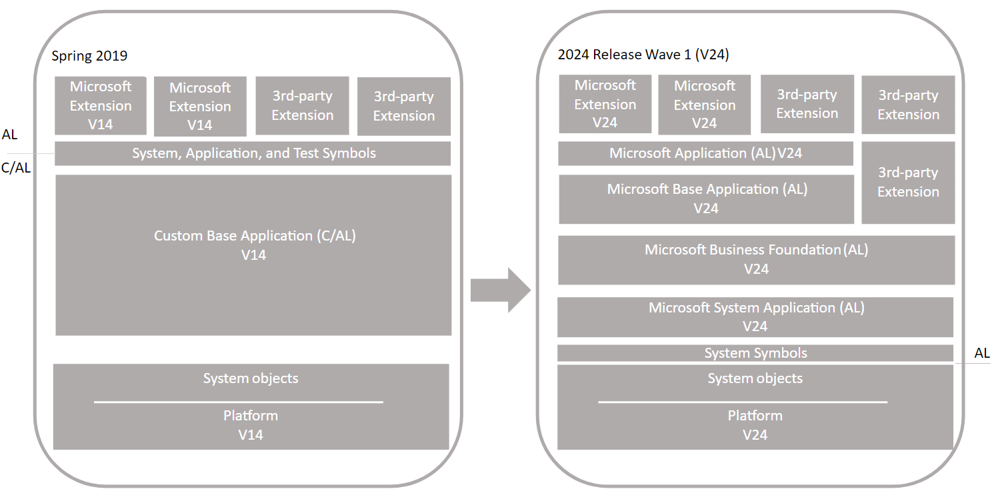
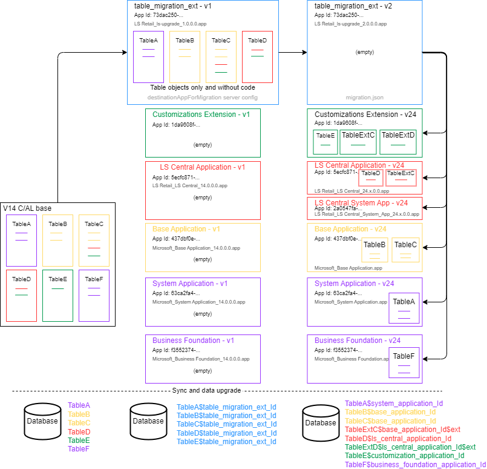
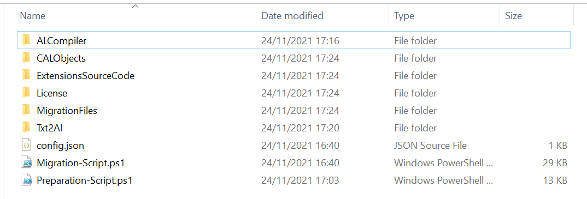
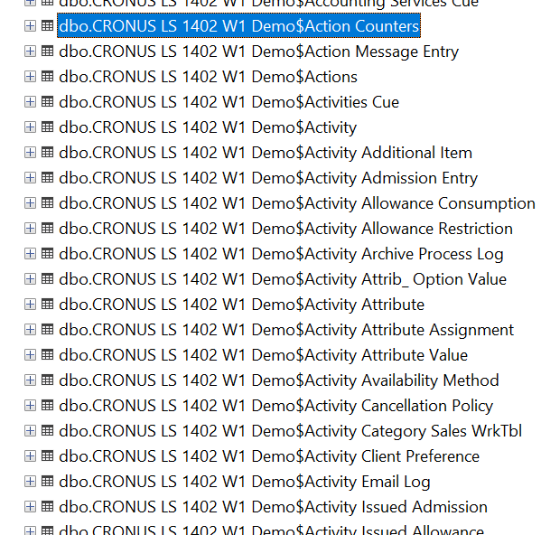
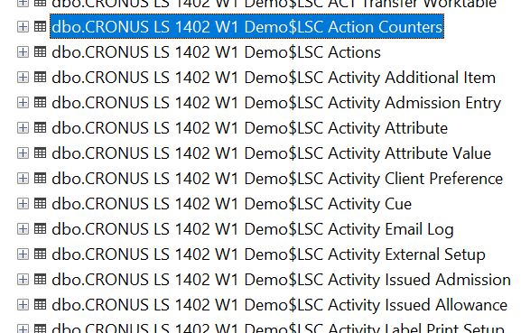
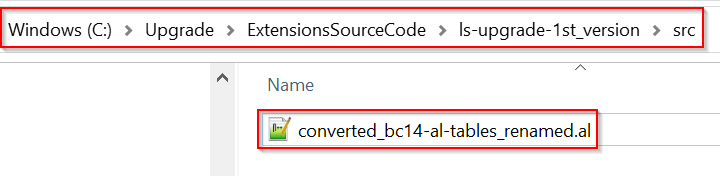
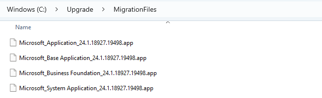
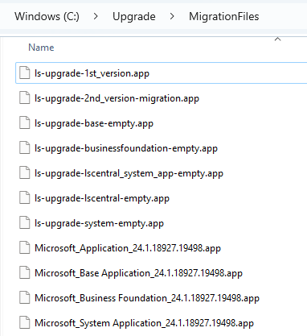
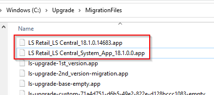

# Upgrading From Version 14 Customized C/AL Application to LS Central 25

This article describes how to upgrade a customized version 14 application to a version 25 solution that uses the Microsoft system and base applications.
Please refer to the official Microsoft documentation for more information: [Upgrading Customized C/AL Application to Microsoft Base Application version 25](https://learn.microsoft.com/en-us/dynamics365/business-central/dev-itpro/upgrade/upgrade-to-microsoft-base-app-v25)



## Table of Contents <!-- omit from toc -->

- [Upgrading From Version 14 Customized C/AL Application to LS Central 25](#upgrading-from-version-14-customized-cal-application-to-ls-central-25)
  - [Overview](#overview)
    - [Single-tenant and multitenant deployments](#single-tenant-and-multitenant-deployments)
    - [Personalization and customizations](#personalization-and-customizations)
  - [Prerequisites](#prerequisites)
  - [Before you begin](#before-you-begin)
    - [Compatibility Matrix](#compatibility-matrix)
    - [Task 1 - Install version 25](#task-1-install-version-25)
    - [Task 2 - Upgrade permission sets](#task-2-upgrade-permission-sets)
  - [Application Upgrade](#application-upgrade)
    - [Task 3 - Move code customizations to extensions](#task-3-move-code-customizations-to-extensions)
  - [Data Upgrade](#data-upgrade)
    - [Preparing the upgrade](#preparing-the-upgrade)
  - [Using the preparation script](#using-the-preparation-script)
    - [Get the AL Compiler from the BC artifacts](#get-the-al-compiler-from-the-bc-artifacts)
    - [Create the folder structure with the extensions needed for the upgrade](#create-the-folder-structure-with-the-extensions-needed-for-the-upgrade)
    - [Compiling the extensions that will be used in the migration](#compiling-the-extensions-that-will-be-used-in-the-migration)
      - [Preparing Business Central 14 objects to be included in the table migration extension](#preparing-business-central-14-objects-to-be-included-in-the-table-migration-extension)
      - [Renaming the tables to conform the new prefixed tables naming - Exporting the tables](#rename-tables-export)
      - [Renaming the tables to conform the new prefixed tables naming - Importing and compiling the tables](#rename-tables-import-compile)
      - [Renaming the tables to conform the new prefixed tables naming - Export the renamed tables](#rename-tables-export-renamed)
      - [Compiling the extensions that will be used in the migration (Continued)](#compiling-the-extensions-that-will-be-used-in-the-migration-continued)
    - [Task 6: Prepare databases](#task-6-prepare-databases)
  - [Executing the upgrade](#executing-the-upgrade)
    - [Task 7: Convert version 14 database](#task-7-convert-version-14-database)
    - [Task 8: Configure version 24 server for DestinationAppsForMigration](#task-8-configure-version-24-server-for-destinationappsformigration)
    - [Task 9: Import License](#task-9-import-license)
    - [Task 10: Publish DestinationAppsForMigrations extensions](#task-10-publish-destinationappsformigrations-extensions)
    - [Task 11: Synchronize tenant](#task-11-synchronize-tenant)
    - [Task 12: Install DestinationAppsForMigration and move tables](#task-12-install-destinationappsformigration-and-move-tables)
    - [Task 13: Publish final extensions](#task-13-publish-final-extensions)
    - [Task 14: Synchronize final extensions](#task-14-synchronize-final-extensions)
    - [Task 15: Upgrade empty table migration extension](#task-15-upgrade-empty-table-migration-extension)
    - [Task 16: Clean sync and unpublish table migration extensions](#task-16-clean-sync-and-unpublish-table-migration-extensions)
    - [Task 17: Upgrade and install final extensions](#task-17-upgrade-and-install-final-extensions)
    - [Task 18: Upgrade control add-ins](#task-18-upgrade-control-add-ins)
    - [Task 19: Install upgraded permissions sets](#task-19-install-upgraded-permissions-sets)
    - [Task 20: Change application version](#task-20-change-application-version)
    - [Post-upgrade tasks](#post-upgrade-tasks)
  - [Related](#related)

## Overview

The upgrade is divided into two sections: Application Upgrade and Data Upgrade. The Application Upgrade section deals with upgrading the application code. For the application upgrade, you'll have to create several extensions. Some of these extensions are only used for upgrade purposes. The Data Upgrade section deals with upgrading the data on tenants - publishing, syncing, and installing extensions. For this scenario, the data upgrade consists of two phases for migrating data from the current tables to extension-based tables. The following figure illustrates the upgrade process.



The process uses two special features for migrating tables and data to extensions:
destinationappsformigration server setting
The destinationappsformigration setting is a configuration setting on the Business Central Server. In short, it's used to transfer ownership of the existing tables to the table migration extension. For more information, see DestinationAppsForMigration.
migration.json file
The migration.json file is used to migrate tables and fields from one extension to another. In this case, migration is from the table migration extension to system and base application tables. For more information about the migration.json, see The Migration.json File.

### Single-tenant and multitenant deployments
https://docs.microsoft.com/en-us/dynamics365/business-central/dev-itpro/upgrade/upgrade-to-microsoft-base-app-v21#single-tenant-and-multitenant-deployments

### Personalization and customizations
https://docs.microsoft.com/en-us/dynamics365/business-central/dev-itpro/upgrade/upgrade-to-microsoft-base-app-v25#personalization-and-customizations

## Prerequisites

- Your version 14 is compatible with version 24.
There are several updates for version 14. The updates have a compatible version 24 update. For more information, see [Dynamics 365 Business Central Upgrade Compatibility Matrix](https://docs.microsoft.com/en-us/dynamics365/business-central/dev-itpro/upgrade/upgrade-v14-v15-compatibility]).
- The version 14 Dynamics NAV Development Shell and Business Central Administration Shell are installed.
- BCContainerHelper and Docker are installed.
Some LS Migration Tools cmdlets requires BCContainerHelper and/or Docker to be installed to work properly.
More info on the installation: [Docker](../appendix.md#docker) / [BCContainerHelper](../appendix.md#bccontainerhelper)
- LSMigrationTools powershell module is installed.
The LS Migration Tools powershell module needs to be installed from the Powershell Gallery before being used for the first time.
More info on the installation: [LSMigrationTools](../appendix.md#ls-migration-tools)
- LS Central Service Components and Data Director Client Tools installed on the Business Central Server instance
This is only applicable to LS Central 20.3 or earlier.
If not installed, you may get some errors related to missing add-ins when installing the LS Central / LS Central System applications.
More info on the installation: [LS Central Service Components](../appendix.md#ls-central-service-components) / [Data Director Client Tools](../appendix.md#data-director-client-tools)

## Before you begin

### Compatibility Matrix

Please make sure to use a compatible version before doing the upgrade:
[Business Central compatibility matrix - Business Central | Microsoft Docs](https://docs.microsoft.com/en-us/dynamics365/business-central/dev-itpro/upgrade/upgrade-v14-v15-compatibility)

### Task 1 - Install version 25 { #task-1-install-version-25 }
https://learn.microsoft.com/en-us/dynamics365/business-central/dev-itpro/upgrade/upgrade-to-microsoft-base-app-v25#task-1-install-version-25

### Task 2 - Upgrade permission sets { #task-2-upgrade-permission-sets }
https://learn.microsoft.com/en-us/dynamics365/business-central/dev-itpro/upgrade/upgrade-to-microsoft-base-app-v25#task-2-upgrade-permission-sets

## Application Upgrade
https://learn.microsoft.com/en-us/dynamics365/business-central/dev-itpro/upgrade/upgrade-to-microsoft-base-app-v25#application-upgrade

### Task 3 - Move code customizations to extensions { #task-3-move-code-customizations-to-extensions }
https://learn.microsoft.com/en-us/dynamics365/business-central/dev-itpro/upgrade/upgrade-to-microsoft-base-app-v25#task-3-move-code-customizations-to-extensions

## Data Upgrade

### Preparing the upgrade

LS Retail created a Powershell module to help you automate some tasks. Below we describe the tool usage and we refer which tasks are being automated when using each command available in the tool.

**Creating the preparation/migration script**

Create a folder where all the files used in the migration are going to be created / copied to.
Example: C:\Upgrade
Open a Powershell console as Administrator and change the current folder to the newly created folder:
`cd C:\Upgrade`

Import the LSMigrationTools module
```powershell
Import-Module LSMigrationTools -Force
```

> LSMigrationTools version 1.0.0
>
> Welcome to the LS Migration Tools Shell!
> For a complete list of Server cmdlets type
>
> `Get-Command -Module LSMigrationTools`
> 

To initialize the upgrade script using the LSMigrationTools script you have two options:

**Option 1 - Use the wizard provided by LS Retail, that is part of the LS Central Migration Tool**

Run the `New-UpgradeInitializationScript` command and follow the wizard instructions to create the config.json file.

```powershell
New-UpgradeInitializationScript
```

For a step-by-step walkthrough of each wizard prompt and example input values, see [New-UpgradeInitializationScript Wizard - Step by Step - v14 to v25 example](v14-to-25-wizard.md).

**Option 2 - Use a previously created a config.json file**

If you have previously created a config.json file using the wizard (see Option 1), there's no need to go through all the wizard steps again. The easiest way to regenerate the scripts is by reusing the existing config.json file with the `New-UpgradeInitializationScript` command.

Below is an example of the config.json file.

```json
{
  "Environment": {
    "Multitenant": false,
    "Localization": "w1"
  },
  "FromBC": {
    "ClientPath": "C:\\Program Files (x86)\\Microsoft Dynamics 365 Business Central\\140",
    "ServerInstance": "BC140",
    "Version": "14.28.47690.0",
    "ServerPath": "C:\\Program Files\\Microsoft Dynamics 365 Business Central\\140",
    "LSVersion": "14.2"
  },
  "Sql": {
    "Instance": "sql2019",
    "Server": "localhost",
    "Database": "ls-w1-14-02-upg"
  },
  "ToBC": {
    "ServerInstance": "BC250",
    "Version": "25.1",
    "ServerPath": "C:\\Program Files\\Microsoft Dynamics 365 Business Central\\250",
    "LSVersion": "25.0"
  },
  "CustomExtensions": [
    {
      "Id": "893ae440-8b91-4124-99ee-5915117ff3e3",
      "Name": "Test 1",
      "Publisher": "Publisher 1",
      "Version": "18.1.5.9"
    },
    {
      "Id": "71a4d751-d6b5-49e2-822e-d128bccc1083",
      "Name": "Test 2",
      "Publisher": "Publisher 2",
      "Version": "17.2"
    }
  ]
}
```

Run the `New-UpgradeInitializationScript` command and use the ConfigFile flag to load an existing config.json file:

```powershell
New-UpgradeInitializationScript -ConfigFile C:\Upgrade\config.json
```

**Final Output**

For both Option 1 and Option 2, the final output in the console will be similar to this:

> ```
>  _____                                 _            _  _    _____              _         _
> |  __ \                               | |          | || |  / ____|            (_)       | |
> | |__) |___ __      __ ___  _ __  ___ | |__    ___ | || | | (___    ___  _ __  _  _ __  | |_  ___
> |  ___// _ \\ \ /\ / // _ \| '__|/ __|| '_ \  / _ \| || |  \___ \  / __|| '__|| || '_ \ | __|/ __|
> | |   | (_) |\ V  V /|  __/| |   \__ \| | | ||  __/| || |  ____) || (__ | |   | || |_) || |_ \__ \
> |_|    \___/  \_/\_/  \___||_|   |___/|_| |_| \___||_||_| |_____/  \___||_|   |_|| .__/  \__||___/
>                                                                                  |_|
> ```
> Preparation Powershell script file exported to C:\Upgrade\Preparation-Script.ps1
> Migration Powershell script file exported to C:\Upgrade\Migration-Script.ps1
> Config file exported to C:\Upgrade\config.json

When the wizard is over, two script files are created in the current folder:

- Preparation-Script.ps1
    - Contains the needed scripts to prepare the upgrade;
- Migration-Script.ps1
    - Contains the needed scripts to go through the upgrade;

## Using the preparation script

The preparation script contains multiple commands available in the LS Migration Tools that will be used in the further steps like:

- Getting the AL compiler from Business Central artifacts, that will be used to compile the extensions without the need to use VSCode;
- Create the folder structure with the extensions needed for the upgrade;
- And a few other steps.

> Open the Preparation-Script.ps1 file on your favorite Powershell IDE (e.g. VS > Code or Powershell ISE) and execute the commands below.

### Get the AL Compiler from the BC artifacts

```powershell
## Get ALCompiler files
Get-ALCompilerFromArtifacts -version xx.x
```

> You should run directly from the Preparation-Script.ps1 file, with the correct version.

Output:
> Unpacking AL Language extension file to tmp folder.using 7zip
> AL Compiler files copied to C:\Upgrade\ALCompiler

### Create the folder structure with the extensions needed for the upgrade

```powershell
## Create migration extensions folders
New-UpgradeAppsStructure -ImportSymbolsApp
```

Output:

> Configuration loaded on C:\Upgrade\config.json.
> WARNING: Please open Readme.txt file in C:\Upgrade\License.
> Created empty folder C:\Upgrade\MigrationFiles.
> Created empty folder C:\Upgrade\CALObjects.
> Created empty folder C:\Upgrade\CALObjects\ALObjects.
> Created empty folder C:\Upgrade\ExtensionsSourceCode.
> Created folder C:\Upgrade\ExtensionsSourceCode\ls-upgrade-1st_version.
> WARNING: Do not forget to copy all the C/AL to AL converted files to this folder before compiling the app.
> Created folder C:\Upgrade\ExtensionsSourceCode\ls-upgrade-2nd_version-migration.
> Created folder C:\Upgrade\ExtensionsSourceCode\ls-upgrade-system-empty.
> Created folder C:\Upgrade\ExtensionsSourceCode\ls-upgrade-businessfoundation-empty.
> Created folder C:\Upgrade\ExtensionsSourceCode\ls-upgrade-base-empty.
> Created folder C:\Upgrade\ExtensionsSourceCode\ls-upgrade-lscentral-empty.
> Created folder C:\Upgrade\ExtensionsSourceCode\ls-upgrade-lscentral_system_app-empty.
> Created folder C:\Upgrade\ExtensionsSourceCode\ls-upgrade-custom-893ae440-8b91-4124-99ee-5915117ff3e3-empty.
> Created folder C:\Upgrade\ExtensionsSourceCode\ls-upgrade-custom-71a4d751-d6b5-49e2-822e-d128bccc1083-empty.
> Found System.app symbols file in: "C:\bcartifacts.cache\onprem\25.3.28755.29378\platform\ModernDev\program files\Microsoft Dynamics NAV\240\AL Development Environment\System.app"
> Copied file from C:\bcartifacts.cache\onprem\25.3.28755.29378\platform\ModernDev\program files\Microsoft Dynamics NAV\240\AL Development Environment\System.app to .\ExtensionsSourceCode\ls-upgrade-1st_version\.alpackages.
> Copied file from C:\bcartifacts.cache\onprem\25.3.28755.29378\platform\ModernDev\program files\Microsoft Dynamics NAV\240\AL Development Environment\System.app to .\ExtensionsSourceCode\ls-upgrade-2nd_version-migration\.alpackages.
> Copied file from C:\bcartifacts.cache\onprem\25.3.28755.29378\platform\ModernDev\program files\Microsoft Dynamics NAV\240\AL Development Environment\System.app to .\ExtensionsSourceCode\ls-upgrade-base-empty\.alpackages.
> Copied file from C:\bcartifacts.cache\onprem\25.3.28755.29378\platform\ModernDev\program files\Microsoft Dynamics NAV\240\AL Development Environment\System.app to .\ExtensionsSourceCode\ls-upgrade-system-empty\.alpackages.
> Copied file from C:\bcartifacts.cache\onprem\25.3.28755.29378\platform\ModernDev\program files\Microsoft Dynamics NAV\240\AL Development Environment\System.app to .\ExtensionsSourceCode\ls-upgrade-lscentral-empty\.alpackages.
> Copied file from C:\bcartifacts.cache\onprem\25.3.28755.29378\platform\ModernDev\program files\Microsoft Dynamics NAV\240\AL Development Environment\System.app to .\ExtensionsSourceCode\ls-upgrade-lscentral_system_app-empty\.alpackages.
> Copied file from C:\bcartifacts.cache\onprem\25.3.28755.29378\platform\ModernDev\program files\Microsoft Dynamics NAV\240\AL Development Environment\System.app to .\ExtensionsSourceCode\ls-upgrade-custom-893ae440-8b91-4124-99ee-5915117ff3e3-empty\.alpackages.
> Copied file from C:\bcartifacts.cache\onprem\25.3.28755.29378\platform\ModernDev\program files\Microsoft Dynamics NAV\240\AL Development Environment\System.app to .\ExtensionsSourceCode\ls-upgrade-custom-71a4d751-d6b5-49e2-822e-d128bccc1083-empty\.alpackages.
> Found Microsoft Business Foundation.app file in: "c:\bcartifacts.cache\onprem\25.3.28755.29378\platform\Applications\BusinessFoundation\Source\Microsoft_Business Foundation.app"
> Found Microsoft Base Application.app file in: "c:\bcartifacts.cache\onprem\25.3.28755.29378\platform\Applications\BaseApp\Source\Microsoft_Base Application.app"
> Copied file from c:\bcartifacts.cache\onprem\25.3.28755.29378\platform\Applications\BaseApp\Source\Microsoft_Base Application.app to .\MigrationFiles\Microsoft_Base Application_25.3.28755.29378.app.
> Found Microsoft System Application.app file in: "c:\bcartifacts.cache\onprem\25.3.28755.29378\platform\Applications\system application\Source\Microsoft_System Application.app"
> Copied file from c:\bcartifacts.cache\onprem\25.3.28755.29378\platform\Applications\system application\Source\Microsoft_System Application.app to .\MigrationFiles\Microsoft_System Application_25.3.28755.29378.app.
> Found Microsoft Application.app file in: "c:\bcartifacts.cache\onprem\25.3.28755.29378\platform\Applications\Application\Source\Microsoft_Application.app"
> Copied file from c:\bcartifacts.cache\onprem\25.3.28755.29378\platform\Applications\Application\Source\Microsoft_Application.app to .\MigrationFiles\Microsoft_Application_25.3.28755.29378.app.
> Finished importing Microsoft apps files.
> Upgrade folders structure successfully created.
> WARNING: If there's additional custom apps, other than the ones on the configFile.json file, don't forget to add the app id to the migration.json file on the ls-upgrade-2nd_version-migration (either editing the file or using the Add-CustomExtension cmdlet).

Folder structure after running these commands:



- License
    - Copy the partner license here and name it DEV.bclicense;
    - More info: Please open Readme.txt file;
- MigrationFiles
    - Folder where all the symbols and extension compiled files should be copied to;
- Objects
    - Folder where the C/AL and AL object files should be copied to;
- ExtensionsSourceCode
    - Folder where the migration extensions will be created.
- ExtensionsSourceCode\ls-upgrade-1st_version
- ExtensionsSourceCode\ls-upgrade-2nd_version-migration
- ExtensionsSourceCode\ls-upgrade-base-empty
- ExtensionsSourceCode\ls-upgrade-businessfoundation-empty
- ExtensionsSourceCode\ls-upgrade-system-empty
- ExtensionsSourceCode\ls-upgrade-lscentral-empty
- ExtensionsSourceCode\ls-upgrade-lscentral_system_app-empty
- ExtensionsSourceCode\<publisher>-<custom extension name>-empty

> The `New-UpgradeAppsStructure` command will automatically create the structure you need to create:
> - The empty System, Business Foundation, Base and customization extensions (see Task 4 on Microsoft guidelines);
> - The table migration extension (see Task 5 on Microsoft guidelines):
> - First version - tables only
> - Second version - empty

### Compiling the extensions that will be used in the migration

The next step is to compile all the extensions to be used in the migration process.
All but the *ls-upgrade-1st_version* extension can be compiled now. For the *ls-upgrade-1st_version* extension an additional step is needed.
This extension consists only of the non-system table objects from your custom base application. The table objects will only include the properties and field definitions. They won't include AL code on triggers or methods. This extension is an interim extension used only during the upgrade.
To get these objects prepared we should do the following steps:

#### Preparing Business Central 14 objects to be included in the table migration extension
Since we’re only taking care of data, for this step we only need to have the Business Central 14 non-system tables, including some properties and field definitions, converted from C/AL to AL.
Additionally, please note that some breaking changes were introduced to LS Central 17.5. Due to our move to SaaS, more than 1000 tables were renamed.
Having said that, we need to handle the renaming somewhere along the migration and we suggest you to do it while still on Business Central 14, by following the steps below.

#### Renaming the tables to conform the new prefixed tables naming - Exporting the tables { #rename-tables-export }

Run the following commands:

> You should run directly from the Preparation-Script.ps1 file.

```powershell
###################### C/AL - Tables renaming in Business Central 14 ######################

$baseFolder = "C:\Upgrade"
$objectsOutputPath = Join-Path $baseFolder "CALObjects"

$fullDatabaseServer = "localhost\sql2019"
$databaseName = "ls-w1-14-02-release"

## BC 14
Import-Module "C:\Program Files\Microsoft Dynamics 365 Business Central\140\Service\NavAdminTool.ps1" -Force
Import-Module "C:\Program Files (x86)\Microsoft Dynamics 365 Business Central\140\Roletailored Client\NavModelTools.ps1" -Force

. "C:\Program Files (x86)\Microsoft Dynamics 365 Business Central\140\Roletailored Client\NavModelTools.ps1" -NavIde "C:\Program Files (x86)\Microsoft Dynamics 365 Business Central\140\Roletailored Client\finsql.exe" -force

Export-NAVApplicationObject -DatabaseServer $fullDatabaseServer -DatabaseName $databaseName -Path (Join-Path $objectsOutputPath 'exported_bc14-cal-tables.txt') -Filter 'Type=Table;Id=1..1999999999'
```

**Output:**

> Directory: C:\Upgrade\CALObjects
> 
> Mode                 LastWriteTime         Length Name
> ----                 -------------         ------ ----
> -a----        25/11/2021     17:57       27132761 exported_bc14-cal-tables.txt

> > If you receive the following error when running the Export-NAVApplicationObject command:
> `Export-NAVApplicationObject : $NavIde was not correctly set. Please assign the path to finsql.exe to $NavIde ($NavIde = path).`
> 
> Just re-run the following line:
> `. "C:\Program Files (x86)\Microsoft Dynamics 365 Business Central\140\Roletailored Client\NavModelTools.ps1" -NavIde "C:\Program Files (x86)\Microsoft Dynamics 365 Business Central\140\Roletailored Client\finsql.exe" -force`

```powershell
Convert-BC14CALObjectsToTableSchemaOnly -ObjectsFilePath (Join-Path $objectsOutputPath 'exported_bc14-cal-tables.txt') -OutputFilePath (Join-Path $objectsOutputPath 'converted_bc14-cal-tables.txt')
```

**Output:**

> Source file processed.
> Will rename LS Central tables.
> File successfully exported.

> Please note that it is possible to rename custom tables if needed. To do that, include the `-CustomTablesMappingFilePath` flag in the Strip-BC14CALObjects.
> Example:
> ```
> Strip-BC14CALObjects -ObjectsFilePath (Join-Path $objectsOutputPath 'exported_bc14-cal-tables.txt') -OutputFilePath (Join-Path $objectsOutputPath 'converted_bc14-cal-tables.txt') -CustomTablesMappingFilePath "C:\migration\extension_1_custommapping.json,C:\migration\extension_2_custommapping.json"
> ```
> 
> Custom mapping file example:
> ```json
> [
>   {
>     "ObjectType": "Table",
>     "ObjectId": "50000",
>     "OldObjectName": "Dummy Table Name 1",
>     "NewObjectName": "New Dummy Table Name 1"
>   },
>   {
>     "ObjectType": "Table",
>     "ObjectId": "50001",
>     "OldObjectName": "Dummy Table Name 2",
>     "NewObjectName": "New Dummy Table Name 2"
>   }
> ]
> ```

#### Renaming the tables to conform the new prefixed tables naming - Importing and compiling the tables { #rename-tables-import-compile }

Next step is to import the text file created previously to your existing BC14 database. That will rename all the tables in the database.
Please note that these objects’ purpose is for data upgrade only since they only contain the table and fields definition.

> You should run directly from the Preparation-Script.ps1 file.

```powershell
Import-NAVApplicationObject -DatabaseServer $fullDatabaseServer -DatabaseName $databaseName -Path (Join-Path $objectsOutputPath 'converted_bc14-cal-tables.txt')
Compile-NAVApplicationObject -DatabaseServer $fullDatabaseServer -DatabaseName $databaseName -Filter 'Type=Table;Id=1..1999999999'
Delete-NAVApplicationObject -DatabaseServer $fullDatabaseServer -DatabaseName $databaseName -Filter 'Type=Table;Id=99009070..99009074|99009077' -SynchronizeSchemaChanges Force
```

> The following tables will be deleted. These tables have been deprecated in LS Central v18.
> 99009070 - Social Media Posting Log
> 99009071 - Social Media Setup
> 99009072 - Social Media Facebook Pages
> 99009073 - Facebook Pages Groups
> 99009074 - Facebook Pages In Groups
> 99009077 - Twitter Applications

Open the Development Environment and make sure that LS Central tables have been renamed and all the tables are compiled (please ignore tables that were not compiled on the original database).

> You may need to run the Compile-NAVApplicationObject command more than once.

Next you must synchronize the tenant database schema with the application database. This will rename the tables in the SQL according to the table naming in Business Central.

```powershell
Sync-NAVTenant -ServerInstance $fromServerInstanceName -Tenant $tenantId -Mode Sync -Force
```

> Please note that no breaking changes should exist so no errors should result be shown.
> After this step you should look at the database in SQL Server Management Studio and confirm the LS Central tables renaming.
> **Before**
> 
>
> **After**
> 

#### Renaming the tables to conform the new prefixed tables naming - Export the renamed tables { #rename-tables-export-renamed }

Now that we have renamed our LS Central tables in Business Central 14, to conform the new table naming introduced in LS 17.5, we need to export the tables to the new AL format to be included in the table migration extension (ls-upgrade-1st_version).

> Please note that:
> - Microsoft provides the txt2al tool to convert the objects from C/AL to AL. Unfortunately, this tool is far from perfect and some rework needs to be done after using it to convert C/AL to AL code. For that reason, on this step, we won’t use the txt2al to have our objects converted from C/AL to AL. We will use the `Convert-BC14CALToStrippedAL` cmdlet from the LS Migration Tools.

The first step is to run the Export-NAVApplicationObject cmdlet again. The exported file will now be called *exported_bc14-cal-tables_renamed.txt*.
```powershell
Export-NAVApplicationObject -DatabaseServer $fullDatabaseServer -DatabaseName $databaseName -Path (Join-Path $objectsOutputPath 'exported_bc14-cal-tables_renamed.txt') -Filter 'Type=Table;Id=1..1999999999&<>1751'
```
And after that, run the `Convert-BC14CALToStrippedAL` cmdlet that will convert the exported C/AL file to the new AL format.
```powershell
Convert-BC14CALToStrippedAL -ObjectsFilePath (Join-Path $objectsOutputPath 'exported_bc14-cal-tables_renamed.txt') -OutputFilePath (Join-Path $objectsOutputPath 'converted_bc14-al-tables_renamed.al)
```

**Output:**
> Source file processed.
> Will rename LS Central tables.
> File successfully exported.

#### Compiling the extensions that will be used in the migration (Continued)

Now that we have renamed the tables on Business Central 14 to conform the table renaming after LS 17.5, we have exported the tables as a text file and converted the file format from C/AL to AL, we will continue with the table migration extensions preparation.
Copy the file exported in the previous step (converted_bc14-al-tables_renamed.al) to the ls-upgrade-1st_version  extension folder (ExtensionsSourceCode\ls-upgrade-1st_version\src) by running this command:
Copy the file exported in the previous step (converted_bc14-al-tables_renamed.al) to the ls-upgrade-1st_version  extension folder (ExtensionsSourceCode\ls-upgrade-1st_version\src) by running this command:
```powershell
Copy-Item (Join-Path $objectsOutputPath 'converted_bc14-al-tables_renamed.al') (Join-Path $baseFolder 'ExtensionsSourceCode\ls-upgrade-1st_version\src')
```



Next step is to compile all the following extensions:
* ls-upgrade-1st_version
* ls-upgrade-2nd_version-migration
* ls-upgrade-base-empty
* ls-upgrade-businessfoundation-empty
* ls-upgrade-system-empty
* ls-upgrade-lscentral-empty
* ls-upgrade-lscentral_system_app-empty
* `<publisher>`-`<custom extension name>`-empty

> The compiled files will be saved in the MigrationFiles folder.

To compile them, use the following commands:

> You should run directly from the Preparation-Script.ps1 file.

```powershell
## Compile each one of the migration extensions

$baseFolder = "C:\Upgrade"

### ls-upgrade-1st_version
$appProjectFolder = Join-Path $baseFolder "ExtensionsSourceCode\ls-upgrade-1st_version"
$appOutputFile = Join-Path $baseFolder "MigrationFiles\ls-upgrade-1st_version.app"
New-CompiledALProjectApp -appProjectFolder $appProjectFolder -appOutputFile $appOutputFile -appSymbolsFolder (Join-Path $appProjectFolder ".alpackages")

### ls-upgrade-2nd_version-migration
$appProjectFolder = Join-Path $baseFolder "ExtensionsSourceCode\ls-upgrade-2nd_version-migration"
$appOutputFile = Join-Path $baseFolder "MigrationFiles\ls-upgrade-2nd_version-migration.app"
New-CompiledALProjectApp -appProjectFolder $appProjectFolder -appOutputFile $appOutputFile -appSymbolsFolder (Join-Path $appProjectFolder ".alpackages")

### ls-upgrade-base-empty
$appProjectFolder = Join-Path $baseFolder "ExtensionsSourceCode\ls-upgrade-base-empty"
$appOutputFile = Join-Path $baseFolder "MigrationFiles\ls-upgrade-base-empty.app"
New-CompiledALProjectApp -appProjectFolder $appProjectFolder -appOutputFile $appOutputFile -appSymbolsFolder (Join-Path $appProjectFolder ".alpackages")

### ls-upgrade-businessfoundation-empty
$appProjectFolder = Join-Path $baseFolder "ExtensionsSourceCode\ls-upgrade- businessfoundation-empty"
$appOutputFile = Join-Path $baseFolder "MigrationFiles\ls-upgrade- businessfoundation-empty.app"
New-CompiledALProjectApp -appProjectFolder $appProjectFolder -appOutputFile $appOutputFile -appSymbolsFolder (Join-Path $appProjectFolder ".alpackages")

### ls-upgrade-system-empty
$appProjectFolder = Join-Path $baseFolder "ExtensionsSourceCode\ls-upgrade-system-empty"
$appOutputFile = Join-Path $baseFolder "MigrationFiles\ls-upgrade-system-empty.app"
New-CompiledALProjectApp -appProjectFolder $appProjectFolder -appOutputFile $appOutputFile -appSymbolsFolder (Join-Path $appProjectFolder ".alpackages")

### ls-upgrade-lscentral-empty
$appProjectFolder = Join-Path $baseFolder "ExtensionsSourceCode\ls-upgrade-lscentral-empty"
$appOutputFile = Join-Path $baseFolder "MigrationFiles\ls-upgrade-lscentral-empty.app"
New-CompiledALProjectApp -appProjectFolder $appProjectFolder -appOutputFile $appOutputFile -appSymbolsFolder (Join-Path $appProjectFolder ".alpackages")

### ls-upgrade-lscentral_system_app-empty
$appProjectFolder = Join-Path $baseFolder "ExtensionsSourceCode\ls-upgrade-lscentral_system_app-empty"
$appOutputFile = Join-Path $baseFolder "MigrationFiles\ls-upgrade-lscentral_system_app-empty.app"
New-CompiledALProjectApp -appProjectFolder $appProjectFolder -appOutputFile $appOutputFile -appSymbolsFolder (Join-Path $appProjectFolder ".alpackages")

### ls-upgrade-custom-893ae440-8b91-4124-99ee-5915117ff3e3-empty
$appProjectFolder = Join-Path $baseFolder "ExtensionsSourceCode\ls-upgrade-custom-893ae440-8b91-4124-99ee-5915117ff3e3-empty"
$appOutputFile = Join-Path $baseFolder "MigrationFiles\ls-upgrade-custom-893ae440-8b91-4124-99ee-5915117ff3e3-empty"
New-CompiledALProjectApp -appProjectFolder $appProjectFolder -appOutputFile $appOutputFile -appSymbolsFolder (Join-Path $appProjectFolder ".alpackages")

### ls-upgrade-custom-71a4d751-d6b5-49e2-822e-d128bccc1083-empty
$appProjectFolder = Join-Path $baseFolder "ExtensionsSourceCode\ls-upgrade-custom-71a4d751-d6b5-49e2-822e-d128bccc1083-empty"
$appOutputFile = Join-Path $baseFolder "MigrationFiles\ls-upgrade-custom-71a4d751-d6b5-49e2-822e-d128bccc1083-empty"
New-CompiledALProjectApp -appProjectFolder $appProjectFolder -appOutputFile $appOutputFile -appSymbolsFolder (Join-Path $appProjectFolder ".alpackages")
```

**Output (similar to each extension):**

> $appOutputFile = Join-Path $baseFolder "MigrationFiles\LS Retail_ls-upgrade_1.0.0.0.app"
> New-CompiledALProjectApp -appProjectFolder $appProjectFolder -appOutputFile $appOutputFile -appSymbolsFolder (Join-Path $appProjectFolder ".alpackages")

> Compiling...
> .\alc.exe /project:"C:\Upgrade\ExtensionsSourceCode\ls-upgrade-1st_version" /packagecachepath:"C:\Upgrade\ExtensionsSourceCode\ls-upgrade-1st_version\.alpackages" /out:"C:\Upgrade\MigrationFiles\LS Retail_ls-upgrade_1.0.0.0.app"
Microsoft (R) AL Compiler version 7.4.7.43206
Copyright (C) Microsoft Corporation. All rights reserved
> 
> Compilation started for project 'ls-upgrade' containing '1' files at '19:51:4.703'.
> 
> 
> Compilation ended at '19:51:7.318'.

> The compilation should occur without errors (but you might receive warnings).
>
> **MigrationFiles** folder before:
> 
>
> **MigrationFiles** folder after:
> 

Finally, copy the **LS Central** app files to the **MigrationFiles**:



> **Note:**
> Version for the .app files should be v25.x.x.x instead.
> 
> **Warning:**
> The LS Central System App and LS Central .app files should be downloaded from the LS Retail Partner Portal or using Update Service.
> Don't use the .app file you get on VSCode after downloading the symbols. These files contains only the symbols and are lacking the source code and won't work > properly.
For more information check **Error 8** in the **Troubleshooting** section.


### Task 6: Prepare databases

Most likely there won’t be any extensions on the database. If, for some reason, there are extensions installed, then you have to uninstall and unpublish them.
To do it, run the following commands:

```powershell
### Task 6: Prepare the existing database (Only applicable if there's any AL extension in the database)
Get-NAVAppInfo -ServerInstance $fromServerInstanceName
Get-NAVAppInfo -ServerInstance $fromServerInstanceName | % { Uninstall-NAVApp -ServerInstance $fromServerInstanceName -Name $_.Name -Version $_.Version -Force }
#### Intelligent Cloud Base will be unpublished last to respect dependencies from other apps.
Get-NAVAppInfo -ServerInstance $fromServerInstanceName | % { if ($_.Name -ne 'Intelligent Cloud Base') { Unpublish-NAVApp -ServerInstance $fromServerInstanceName -Name $_.Name -Version $_.Version } }
Get-NAVAppInfo -ServerInstance $fromServerInstanceName -SymbolsOnly | % { Unpublish-NAVApp -ServerInstance $fromServerInstanceName -Name $_.Name -Version $_.Version -Force }
```

Repeat if needed, until you get no extensions listed from the Get-NAVAppInfo cmdlet.

> **Warning**
> Clear references to .flf license, if used by the database.
> A .bclicense license type was introduced in 17.12, 18.7, 19.1. Starting in 2023 release wave 1 (v22), the .flf license type can no longer be used. If your database is using an .flf, you must delete all references to the .flf file in the database. Otherwise, you'll have problems trying to complete the upgrade process.
> To delete references to the .flf file, run the following SQL query on the database, for example, by using SQL Server Management Studio:
> `UPDATE [master].[dbo].[$ndo$srvproperty] SET [license] = null`
> `UPDATE [`<app database name>`].[dbo].[$ndo$dbproperty] SET [license] = null`
> `UPDATE [`<tenant database name>`].[dbo].[$ndo$tenantproperty] SET [license] = null
> Replace `<app database name>` and `<tenant database name>` with the name of your application and tenant databases, respectively.


## Executing the upgrade

Now that everything is setup, we can move on with the upgrade.
Open the Migration-Script.ps1 in your favorite Powershell IDE and run the commands below.

> Note:
> Don't reuse the some Powershell console used for the Preparation-Script.ps1 file because older version from the BC Administration Shell will be loaded in memory. Open a new Powershell console and then the commands in the Migration-Script.ps1 file.
> You should run the script, line by line, directly from the Migration-Script.ps1 file.

Setup all the variables:

```powershell
######################################################### Step 1 - Going from LS Central 14.2 (on BC 14.28) to LS Central 24.0 (on BC 24.0) #############################################################
############# WARNING: Please make sure that you close and open a new Powershell console window otherwise Business Central Powershell modules might not load properly (Invoke-NAVApplicationDatabaseConversion will not be found) #########

## BC Folders
$toBCServerPath = "C:\Program Files\Microsoft Dynamics 365 Business Central\240"

## BC Server Instances
$toServerInstanceName = "BC240"

## SQL
$fullDatabaseServer = "localhost\sql2019"
$databaseServerOnly = "localhost"
$databaseInstance = "sql2019"
$databaseName = "ls-w1-14-02-upg"

###################################################################################################################################

## Base folder
$baseFolder = "C:\Upgrade"

# Internal variables builder
$migrationFilesPath = Join-Path $baseFolder "MigrationFiles"
$licenseFile = Join-Path $baseFolder "License\DEV.bclicense"

$tenantId = "default"

$ErrorActionPreference = "Stop"

# LS Central 24.0 (BC 24.0)
Import-Module (Join-Path $toBCServerPath 'Service\NavAdminTool.ps1') -Force
```

Execute tasks on Microsoft documentation, starting at task 7.

> Please refer to the Microsoft documentation, on each task, for more related information.

### Task 7: Convert version 14 database

```powershell
# Task 7: Convert version 14 database
Invoke-NAVApplicationDatabaseConversion -DatabaseServer $fullDatabaseServer -DatabaseName $databaseName -Force
```

**Output:**

> DatabaseServer      : localhost\sql2019
> DatabaseName        : ls-w1-14-02-upg
> DatabaseCredentials :
> DatabaseLocation    :
> Collation           :

### Task 8: Configure version 24 server for DestinationAppsForMigration

```powershell
# Task 8: Configure version 24 server for DestinationAppsForMigration
Set-NAVServerConfiguration -ServerInstance $toServerInstanceName -KeyName DatabaseServer -KeyValue $databaseServerOnly
Set-NAVServerConfiguration -ServerInstance $toServerInstanceName -KeyName DatabaseName -KeyValue $databaseName
Set-NAVServerConfiguration -ServerInstance $toServerInstanceName -KeyName DatabaseInstance -KeyValue $databaseInstance
Set-NavServerConfiguration -ServerInstance $toServerInstanceName -KeyName EnableTaskScheduler -KeyValue false
Set-NAVServerConfiguration -ServerInstance $toServerInstanceName -KeyName DestinationAppsForMigration -KeyValue '[{"appId":"73dac250-f355-4b89-9b27-f98837f2d1f2", "name":"ls-upgrade", "publisher": "LS Retail"}]'

Restart-NAVServerInstance -ServerInstance $toServerInstanceName
```

**Output:**

<font color="orange">
> WARNING: The new settings value will not take effect until you stop and restart the service.
> WARNING: The new settings value will not take effect until you stop and restart the service.
> WARNING: The new settings value will not take effect until you stop and restart the service.
> WARNING: The new settings value will not take effect until you stop and restart the service.
> WARNING: The new settings value will not take effect until you stop and restart the service.
</font>
>
> ServerInstance : MicrosoftDynamicsNavServer$BC240
> DisplayName    : Microsoft Dynamics 365 Business Central Server \[BC240\]
> State          : Running
> ServiceAccount : NT AUTHORITY\NETWORK SERVICE
> Version        : 24.0.27224.27469
> Default        : False

### Task 9: Import License

```powershell
# Task 9: Import License
Import-NAVServerLicense -ServerInstance $toServerInstanceName -LicenseFile $licenseFile -Tenant $tenantId
Restart-NAVServerInstance -ServerInstance $toServerInstanceName
```

**Output:**
> <font color="orange">WARNING: Importing a license file requires a restart of other services using the same database.</font>
> 
> ServerInstance : MicrosoftDynamicsNavServer$BC210
> DisplayName    : Microsoft Dynamics 365 Business Central Server \[BC240\]
> State          : Running
> ServiceAccount : NT AUTHORITY\NETWORK SERVICE
> Version        : 24.0.27224.27469
> Default        : False

> If you get the following error:
> `Import-NAVServerLicense : The ls-w1-14-02-upg database has version 1250 which is not supported by this version of Microsoft Dynamics 365 Business > Central Server. Please contact your administrator.`
>
> Just synchronize the tenant by running the following line on task 11:
> ```powershell
> Sync-NAVTenant -ServerInstance $toServerInstanceName -Mode Sync -Force
> ```

### Task 10: Publish DestinationAppsForMigrations extensions

```powershell
# Task 10: Publish DestinationAppsForMigrations extensions
Publish-NAVApp -ServerInstance $toServerInstanceName -Path (Join-Path $migrationFilesPath 'ls-upgrade-1st_version.app') -SkipVerification
Publish-NAVApp -ServerInstance $toServerInstanceName -Path (Join-Path $migrationFilesPath 'ls-upgrade-system-empty.app') -SkipVerification
Publish-NAVApp -ServerInstance $toServerInstanceName -Path (Join-Path $migrationFilesPath 'ls-upgrade-businessfoundation-empty.app') -SkipVerification
Publish-NAVApp -ServerInstance $toServerInstanceName -Path (Join-Path $migrationFilesPath 'ls-upgrade-base-empty.app') -SkipVerification
Publish-NAVApp -ServerInstance $toServerInstanceName -Path (Join-Path $migrationFilesPath 'ls-upgrade-lscentral-empty.app') -SkipVerification
Publish-NAVApp -ServerInstance $toServerInstanceName -Path (Join-Path $migrationFilesPath 'ls-upgrade-lscentral_system_app-empty.app') -SkipVerification
Publish-NAVApp -ServerInstance $toServerInstanceName -Path (Join-Path $migrationFilesPath 'ls-upgrade-custom-893ae440-8b91-4124-99ee-5915117ff3e3-empty.app') -SkipVerification
Publish-NAVApp -ServerInstance $toServerInstanceName -Path (Join-Path $migrationFilesPath 'ls-upgrade-custom-71a4d751-d6b5-49e2-822e-d128bccc1083-empty.app') -SkipVerification
Restart-NAVServerInstance -ServerInstance $toServerInstanceName
Get-NAVAppInfo -ServerInstance $toServerInstanceName
```

### Task 11: Synchronize tenant

```powershell
# Task 11: Synchronize tenant
Sync-NAVTenant -ServerInstance $toServerInstanceName -Mode Sync -Force
Sync-NAVApp -ServerInstance $toServerInstanceName -Name "ls-upgrade" -Version 1.0.0.0
Sync-NAVApp -ServerInstance $toServerInstanceName -Name "System Application" -Version 14.0.0.0
Sync-NAVApp -ServerInstance $toServerInstanceName -Name "Business Foundation" -Version 14.0.0.0
Sync-NAVApp -ServerInstance $toServerInstanceName -Name "Base Application" -Version 14.0.0.0
Sync-NAVApp -ServerInstance $toServerInstanceName -Name "LS Central System App" -Version 14.0.0.0
Sync-NAVApp -ServerInstance $toServerInstanceName -Name "LS Central" -Version 14.0.0.0
Sync-NAVApp -ServerInstance $toServerInstanceName -Name "Test 1" -Version 0.0.0.1
Sync-NAVApp -ServerInstance $toServerInstanceName -Name "Test 2" -Version 0.0.0.1
```

### Task 12: Install DestinationAppsForMigration and move tables

<p style="background-color: yellow">TODO: Review the script powershell. Tenant must be included only for Multitenant environments.</p>

```powershell
# Task 12: Install DestinationAppsForMigration and move tables
Start-NAVDataUpgrade -ServerInstance $toServerInstanceName -Tenant $tenantId -FunctionExecutionMode Serial -SkipAppVersionCheck -Force
Get-NavDataUpgrade -ServerInstance $toServerInstanceName -Tenant $tenantId -Progress
Get-NavDataUpgrade -ServerInstance $toServerInstanceName -Tenant $tenantId -Detailed  # To see detailed information on the steps on the data upgrade process.
Get-NAVTenant -ServerInstance $toServerInstanceName -Tenant $tenantId  # Unlocks the upgrade process for the next task.

Install-NAVApp -ServerInstance $toServerInstanceName -Name "System Application" -Version 14.0.0.0
Install-NAVApp -ServerInstance $toServerInstanceName -Name " Business Foundation" -Version 14.0.0.0
Install-NAVApp -ServerInstance $toServerInstanceName -Name "Base Application" -Version 14.0.0.0
Install-NAVApp -ServerInstance $toServerInstanceName -Name "LS Central System App" -Version 14.0.0.0
Install-NAVApp -ServerInstance $toServerInstanceName -Name "LS Central" -Version 14.0.0.0
Install-NAVApp -ServerInstance $toServerInstanceName -Name "Test 1" -Version 0.0.0.1
Install-NAVApp -ServerInstance $toServerInstanceName -Name "Test 2" -Version 0.0.0.1
```

### Task 13: Publish final extensions

```powershell
# Task 13: Publish final extensions
Publish-NAVApp -ServerInstance $toServerInstanceName -Path (Join-Path $migrationFilesPath 'ls-upgrade-2nd_version-migration.app') -SkipVerification
Publish-NAVApp -ServerInstance $toServerInstanceName -Path (Join-Path $migrationFilesPath 'Microsoft_System Application_25.3.28755.29378.app') -SkipVerification
Publish-NAVApp -ServerInstance $toServerInstanceName -Path (Join-Path $migrationFilesPath 'Microsoft_Business Foundation_25.3.28755.29378.app') -SkipVerification
Publish-NAVApp -ServerInstance $toServerInstanceName -Path (Join-Path $migrationFilesPath 'Microsoft_Base Application_25.3.28755.29378.app') -SkipVerification
$appInfo = (Get-NAVAppInfo -ServerInstance $toServerInstanceName -Name "Application" -SymbolsOnly)[0]

Unpublish-NAVApp -ServerInstance $toServerInstanceName -Name "Application" -Version $appInfo.Version.ToString()
Publish-NAVApp -ServerInstance $toServerInstanceName -Path (Join-Path $migrationFilesPath 'Microsoft_Application_25.3.28755.29378.app') -SkipVerification

Publish-NAVApp -ServerInstance $toServerInstanceName -Path (Join-Path $migrationFilesPath "LS Retail_LS Central System App_25.3.0.770_runtime.app") -SkipVerification
Publish-NAVApp -ServerInstance $toServerInstanceName -Path (Join-Path $migrationFilesPath "LS Retail_LS Central_25.3.0.770.app") -SkipVerification
Publish-NAVApp -ServerInstance $toServerInstanceName -Path (Join-Path $migrationFilesPath 'ls-upgrade-custom-893ae440-8b91-4124-99ee-5915117ff3e3-empty.app') -SkipVerification
Publish-NAVApp -ServerInstance $toServerInstanceName -Path (Join-Path $migrationFilesPath 'ls-upgrade-custom-71a4d751-d6b5-49e2-822e-d128bccc1083-empty.app') -SkipVerification
Get-NAVAppInfo -ServerInstance $toServerInstanceName
```

### Task 14: Synchronize final extensions

```powershell
# Task 14: Synchronize final extensions
Sync-NAVApp -ServerInstance $toServerInstanceName -Name "System Application" -Version 25.3.28755.29378
Sync-NAVApp -ServerInstance $toServerInstanceName -Name "Business Foundation" -Version 25.3.28755.29378
Sync-NAVApp -ServerInstance $toServerInstanceName -Name "Base Application" -Version 25.3.28755.29378
Sync-NAVApp -ServerInstance $toServerInstanceName -Name "Application" -Version 25.3.28755.29378
Sync-NAVApp -ServerInstance $toServerInstanceName -Name "LS Central System App" -Version 25.3.0.770
Sync-NAVApp -ServerInstance $toServerInstanceName -Name "LS Central" -Version 25.3.0.770
Sync-NAVApp -ServerInstance $toServerInstanceName -Name "Test 1" -Version 18.1.5.9
Sync-NAVApp -ServerInstance $toServerInstanceName -Name "Test 2" -Version 17.2
Sync-NAVApp -ServerInstance $toServerInstanceName -Tenant $tenantId -Name "ls-upgrade" -Version 2.0.0.0 #  -Mode ForceSync # -> Only if needed.
```

> Expected errors on line 9:
> 
> ```powershell
> Sync-NAVApp : Table LSC POS Serial Device :: Changing fields for the key 'Key1' is not allowed. Previous list: 'Profile ID', 'Device ID', new List: 'Device ID'.
> ```
> Table **LSC POS Trans. Line** :: The field 'LSTimeStamp' cannot be located. Removing fields is not allowed.
> Table **LSC Member Communication Log** :: The field 'Multi Media Platform' cannot be located. Removing fields is not allowed.
> Table **LSC Member Communication Log** :: The field 'Facebook Page' cannot be located. Removing fields is not allowed.
> Table **LSC Member Communication Log** :: The field 'Twitter Account' cannot be located. Removing fields is not allowed.
> Table **LSC Retail Image Buffer** :: The field 'Code' has changed the length of the data type from '10' to '20'. Changing the length of the data type on fields is not allowed.
> Table **LSC Retail Image Buffer** :: The field 'Social Media Platform' cannot be located. Removing fields is not allowed.
> Table **LSC Retail Image Buffer** :: The field 'Picture' has changed its data type from 'NavText' to 'NavMedia'. Changing the data type of fields is not allowed.
> Table **LSC Retail Image Buffer** :: The field 'Description' has reduced the length of the data type from '250' to '100'. Reducing the length of the data type on fields is not allowed.
> Table **LSC Retail Image Buffer** :: The field 'Import/Export Status' has changed its data type from 'NavText' to 'NavOption'. Changing the data type of fields is not allowed.
> Table **LSC Retail Image Buffer** :: Changing fields for the key 'Key1' is not allowed. Previous list: 'Code', new List: 'Entry No.'.
> Table **LSC Retail Image Buffer** :: Introducing a new key 'Key2' as being unique is not allowed. Remove the 'Unique' property from the key 'Key2' or set it explicitly to false.
> Table **Social Media Facebook Pages** :: The table 'Social Media Facebook Pages' cannot be located. Removing tables is not allowed unless they are temporary or are being moved by migration to
another app.
> Table F**acebook Pages Groups** :: The table 'Facebook Pages Groups' cannot be located. Removing tables is not allowed unless they are temporary or are being moved by migration to another app.
> Table **Facebook Pages In Groups** :: The table 'Facebook Pages In Groups' cannot be located. Removing tables is not allowed unless they are temporary or are being moved by migration to another
app.
> Table **Twitter Applications** :: The table 'Twitter Applications' cannot be located. Removing tables is not allowed unless they are temporary or are being moved by migration to another app.
> 
> Table **LSC POS Serial Device** :: Changing fields for the key 'Key1' is not allowed. Previous list: 'Profile ID', 'Device ID', new List: 'Device ID'” -> Error can be ignored.

> Table **LSC POS Trans. Line** :: The field 'LSTimeStamp' cannot be located -> Error can be ignored.
> 
> **LSC Member Communication Log** replaces **Social Media Posting Log** and error can be ignored.
> **LSC Retail Image Buffer** replaces the deprecated **Social Media Setup** table and error can be ignored.
> **Social Media Facebook Pages** table was deprecated and error can be ignored.
> **Facebook Pages Groups** table was deprecated and error can be ignored.
> **Facebook Pages In Groups** table was deprecated and error can be ignored.
> **Twitter Applications** table was deprecated and error can be ignored.
> 
> If no other errors are presented, they you can run the Sync command with the `ForceSync` Mode flag, otherwise you should look at the errors and check if you can ForceSync.
> Please remember that the data on the table can be deleted when forcing the synchronization.
> ```powershell
> Sync-NAVApp -ServerInstance $toServerInstanceName -Name "ls-upgrade" -Version 2.0.0.0 -Mode ForceSync
> ```

### Task 15: Upgrade empty table migration extension

```powershell
# Task 15: Upgrade empty table migration extension
Start-NAVAppDataUpgrade -ServerInstance $toServerInstanceName -Name "ls-upgrade" -Version 2.0.0.0
```

### Task 16: Clean sync and unpublish table migration extensions

```powershell
# Task 16: Clean sync and unpublish table migration extensions
Uninstall-NAVApp -ServerInstance $toServerInstanceName -Tenant $tenantId -Name "ls-upgrade" -Version 2.0.0.0
Sync-NAVApp -ServerInstance $toServerInstanceName -Tenant $tenantId -Name "ls-upgrade" -Version 1.0.0.0 -Mode clean
Sync-NAVApp -ServerInstance $toServerInstanceName -Tenant $tenantId -Name "ls-upgrade" -Version 2.0.0.0 -Mode clean
Unpublish-NAVApp -ServerInstance $toServerInstanceName -Name "ls-upgrade" -Version 1.0.0.0
Unpublish-NAVApp -ServerInstance $toServerInstanceName -Name "ls-upgrade" -Version 2.0.0.0
```

### Task 17: Upgrade and install final extensions

```powershell
# Task 17: Upgrade and install final extensions
Start-NAVAppDataUpgrade -ServerInstance $toServerInstanceName -Name "System Application" -Version 25.3.28755.29378
Start-NAVAppDataUpgrade -ServerInstance $toServerInstanceName -Name "Business Foundation" -Version 25.3.28755.29378
Start-NAVAppDataUpgrade -ServerInstance $toServerInstanceName -Name "Base Application" -Version 25.3.28755.29378
Install-NAVApp -ServerInstance $toServerInstanceName -Name "Application" -Version 25.3.28755.29378
Start-NAVAppDataUpgrade -ServerInstance $toServerInstanceName -Name "LS Central System App" -Version 25.3.0.770
Start-NAVAppDataUpgrade -ServerInstance $toServerInstanceName -Name "LS Central" -Version 25.3.0.770
Start-NAVAppDataUpgrade -ServerInstance $toServerInstanceName -Name "Test 1" -Version 18.1.5.9
Start-NAVAppDataUpgrade -ServerInstance $toServerInstanceName -Name "Test 2" -Version 17.2
Restart-NAVServerInstance -ServerInstance $toServerInstanceName
```

### Task 18: Upgrade control add-ins

```powershell
# Task 18: Upgrade control add-ins
$servicesAddinsFolder = Join-Path $toBCServerPath 'Service\Add-ins'
Set-NAVAddIn -ServerInstance $toServerInstanceName -AddinName 'Microsoft.Dynamics.Nav.Client.BusinessChart' -PublicKeyToken 31bf3856ad364e35 -ResourceFile (Join-Path $servicesAddinsFolder 'BusinessChart\Microsoft.Dynamics.Nav.Client.BusinessChart.zip')
Set-NAVAddIn -ServerInstance $toServerInstanceName -AddinName 'Microsoft.Dynamics.Nav.Client.FlowIntegration' -PublicKeyToken 31bf3856ad364e35 -ResourceFile (Join-Path $servicesAddinsFolder 'FlowIntegration\Microsoft.Dynamics.Nav.Client.FlowIntegration.zip')
Set-NAVAddIn -ServerInstance $toServerInstanceName -AddinName 'Microsoft.Dynamics.Nav.Client.OAuthIntegration' -PublicKeyToken 31bf3856ad364e35 -ResourceFile (Join-Path $servicesAddinsFolder 'OAuthIntegration\Microsoft.Dynamics.Nav.Client.OAuthIntegration.zip')
Set-NAVAddIn -ServerInstance $toServerInstanceName -AddinName 'Microsoft.Dynamics.Nav.Client.PageReady' -PublicKeyToken 31bf3856ad364e35 -ResourceFile (Join-Path $servicesAddinsFolder 'PageReady\Microsoft.Dynamics.Nav.Client.PageReady.zip')
Set-NAVAddIn -ServerInstance $toServerInstanceName -AddinName 'Microsoft.Dynamics.Nav.Client.PowerBIManagement' -PublicKeyToken 31bf3856ad364e35 -ResourceFile (Join-Path $servicesAddinsFolder 'PowerBIManagement\Microsoft.Dynamics.Nav.Client.PowerBIManagement.zip')
Set-NAVAddIn -ServerInstance $toServerInstanceName -AddinName 'Microsoft.Dynamics.Nav.Client.RoleCenterSelector' -PublicKeyToken 31bf3856ad364e35 -ResourceFile (Join-Path $servicesAddinsFolder 'RoleCenterSelector\Microsoft.Dynamics.Nav.Client.RoleCenterSelector.zip')
Set-NAVAddIn -ServerInstance $toServerInstanceName -AddinName 'Microsoft.Dynamics.Nav.Client.SatisfactionSurvey' -PublicKeyToken 31bf3856ad364e35 -ResourceFile (Join-Path $servicesAddinsFolder 'SatisfactionSurvey\Microsoft.Dynamics.Nav.Client.SatisfactionSurvey.zip')
Set-NAVAddIn -ServerInstance $toServerInstanceName -AddinName 'Microsoft.Dynamics.Nav.Client.VideoPlayer' -PublicKeyToken 31bf3856ad364e35 -ResourceFile (Join-Path $servicesAddinsFolder 'VideoPlayer\Microsoft.Dynamics.Nav.Client.VideoPlayer.zip')
Set-NAVAddIn -ServerInstance $toServerInstanceName -AddinName 'Microsoft.Dynamics.Nav.Client.WebPageViewer' -PublicKeyToken 31bf3856ad364e35 -ResourceFile (Join-Path $servicesAddinsFolder 'WebPageViewer\Microsoft.Dynamics.Nav.Client.WebPageViewer.zip')
Set-NAVAddIn -ServerInstance $toServerInstanceName -AddinName 'Microsoft.Dynamics.Nav.Client.WelcomeWizard' -PublicKeyToken 31bf3856ad364e35 -ResourceFile (Join-Path $servicesAddinsFolder 'WelcomeWizard\Microsoft.Dynamics.Nav.Client.WelcomeWizard.zip')
```

> If you get an error related to some of these add-ins, like:
`The Add-in does not exist. Identification fields and values: Add-in Name='Microsoft.Dynamics.Nav.Client.SatisfactionSurvey',Public Key
Token='31bf3856ad364e35',Version=''`
> Just ignore and do not run that specific line on the script.

### Task 19: Install upgraded permissions sets

https://docs.microsoft.com/en-us/dynamics365/business-central/dev-itpro/upgrade/upgrade-to-microsoft-base-app-v21#task-19-install-upgraded-permissions-sets

### Task 20: Change application version

```powershell
# Task 20: Change application version
Set-NAVApplication -ServerInstance $toServerInstanceName -ApplicationVersion 25.3.28755.29378 -Force
Sync-NAVTenant -ServerInstance $toServerInstanceName -Mode Sync -Force

Start-NAVDataUpgrade -ServerInstance $toServerInstanceName -Tenant $tenantId -FunctionExecutionMode Serial
Get-NavDataUpgrade -ServerInstance $toServerInstanceName -Tenant $tenantId -Progress
Get-NavDataUpgrade -ServerInstance $toServerInstanceName -Tenant $tenantId -Detailed
Get-NAVTenant -ServerInstance $toServerInstanceName -Tenant $tenantId
```

### Post-upgrade tasks

```powershell
# Post-upgrade tasks
Unpublish-NAVApp -ServerInstance $toServerInstanceName -Name "System Application" -Version 14.0.0.0
Unpublish-NAVApp -ServerInstance $toServerInstanceName -Name " Business Foundation" -Version 14.0.0.0
Unpublish-NAVApp -ServerInstance $toServerInstanceName -Name "Base Application" -Version 14.0.0.0
Unpublish-NAVApp -ServerInstance $toServerInstanceName -Name "LS Central" -Version 14.0.0.0
Unpublish-NAVApp -ServerInstance $toServerInstanceName -Name "LS Central System App" -Version 14.0.0.0
Unpublish-NAVApp -ServerInstance $toServerInstanceName -Name "Test 1" -Version 0.0.0.1
Unpublish-NAVApp -ServerInstance $toServerInstanceName -Name "Test 2" -Version 0.0.0.1
Get-NAVAppInfo -ServerInstance $toServerInstanceName

Set-NavServerConfiguration -ServerInstance $toServerInstanceName -KeyName EnableTaskScheduler -KeyValue true

Restart-NAVServerInstance -ServerInstance $toServerInstanceName
```

Check remaining Post-upgrade tasks in Microsoft documentation - from number 4:
[Upgrading Customized C/AL Application to Microsoft Base Application version 25 - Post Upgrade Tasks](https://learn.microsoft.com/en-us/dynamics365/business-central/dev-itpro/upgrade/upgrade-to-microsoft-base-app-v25#post-upgrade-tasks)


## Related

- [Version history](../version-history.md)
- [Upgrade v15-24 -> v25](v15-24-to-v25.md)
- [Upgrade v25 or later -> latest](v25-or-later-to-latest.md)
