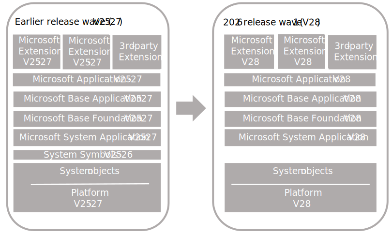
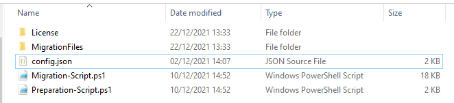

# Upgrading From Version 25-27 up to Version 28 (latest)

This article describes how to upgrade from version 25-27 up to latest (version 28) solution that uses the Microsoft system and base applications.
Please refer to the official Microsoft documentation for more information: [Upgrading Microsoft System and Base Application to Version 28](https://learn.microsoft.com/en-us/dynamics365/business-central/dev-itpro/upgrade/upgrade-unmodified-application-to-v28)



The process for upgrading is similar for a single-tenant and multitenant deployment. However, there are some inherent differences. With a single-tenant deployment, the application code and business data are in the same database. In a multitenant deployment, application code is in a separate database (the application database) than the business data (tenant). In the procedures that follow, for a single-tenant deployment, consider references to the application database and tenant database as the same database. Steps are marked as Single-tenant only or Multitenant only where applicable.

## Table of Contents <!-- omit from toc -->

- [Upgrading From Version 25-27 up to Version 28 (latest)](#upgrading-from-version-25-27-up-to-version-28-latest)
  - [Prerequisites](#prerequisites)
  - [Before you begin](#before-you-begin)
    - [Compatibility Matrix](#compatibility-matrix)
    - [Prepare new runtime packages](#prepare-new-runtime-packages)
    - [Preparing the upgrade](#preparing-the-upgrade)
  - [Using the preparation script](#using-the-preparation-script)
    - [Create the folder structure with the extensions needed for the upgrade](#create-the-folder-structure-with-the-extensions-needed-for-the-upgrade)
  - [Executing the upgrade](#executing-the-upgrade)
    - [Task 2 – Install version 28](#task-2-install-version-28)
    - [Task 3 – Upgrade permission sets](#task-3-upgrade-permission-sets)
    - [Task 4 – Prepare the existing databases](#task-4-prepare-existing-databases)
    - [Task 5: Convert application database to version 28](#task-5-convert-application-database-to-version-28)
    - [Task 6: Configure version 28 server](#task-6-configure-version-28-server)
    - [Task 7: Import version 28 license](#task-7-import-version-28-license)
    - [Task 8: Synchronize tenant](#task-8-synchronize-tenant)
    - [Task 9: Publish extensions](#task-9-publish-extensions)
    - [Task 10: Synchronize tenant with extensions](#task-10-synchronize-tenant-with-extensions)
    - [Task 11: Upgrade data](#task-11-upgrade-data)
    - [Task 13: Upgrade control add-ins](#task-13-upgrade-control-add-ins)
    - [Task 14: Install upgraded permissions sets](#task-14-install-upgraded-permissions-sets)
    - [Post-upgrade tasks](#post-upgrade-tasks)
      - [Updating the application version shown on the Help and Support page](#updating-the-application-version-shown-on-the-help-and-support-page)
      - [Enabling task scheduler on the server instance](#enabling-task-scheduler-on-the-server-instance)
      - [Importing the customer license](#importing-the-customer-license)


## Prerequisites

- Your Business Central version is compatible with version 28.
The updates have a compatible version 28 update.
For more information, see Dynamics 365 Business Central Upgrade Compatibility Matrix.
- The Dynamics NAV Development Shell and Business Central Administration Shell are installed.
- BCContainerHelper and Docker are installed.
Some LS Migration Tools cmdlets requires BCContainerHelper and/or Docker to be installed to work properly.
More info on the installation: [Docker](../appendix.md#docker) / [BCContainerHelper](../appendix.md#bccontainerhelper)
- LSMigrationTools powershell module is installed.
The LS Migration Tools powershell module needs to be installed from the Powershell Gallery before being used for the first time.
More info on the installation: [LSMigrationTools](../appendix.md#ls-migration-tools)

- LS Central Service Components and Data Director Client Tools installed on the Business Central Server instance
This is only applicable to LS Central 20.3 or earlier.
If not installed, you may get some errors related to missing add-ins when installing the LS Central / LS Central System applications.
More info on the installation: [LS Central Service Components](../appendix.md#ls-central-service-components) / [Data Director Client Tools](../appendix.md#data-director-client-tools)

## Before you begin

### Compatibility Matrix

Please make sure to use a compatible version before doing the upgrade:
[Business Central compatibility matrix - Business Central | Microsoft Learn](https://learn.microsoft.com/en-us/dynamics365/business-central/dev-itpro/upgrade/upgrade-v14-v15-compatibility)

### Prepare new runtime packages

If a deployment uses extensions that are published as runtime packages, create new versions of runtime packages against the new platform and application. Although you could run Repair-NAVapp on the extensions instead, as described later in this article, this way isn't recommended. Using Repair-NAVapp can lead to problems with the extensions after upgrade.
For more information, see Creating Runtime Packages for Business Central On-Premises.

### Preparing the upgrade

LS Retail created a Powershell module to help you automate some tasks. Below we describe the tool usage and we refer which tasks are being automated when using each command available in the tool.

**Creating the preparation/migration script**

Create a folder where all the files used in the migration are going to be created / copied to.
Example: C:\Upgrade
Open a Powershell console as Administrator and change the current folder to the newly created folder:
`cd C:\Upgrade`

Import the LSMigrationTools module
```powershell
Import-Module LSMigrationTools -Force
```

> LSMigrationTools version 1.0.0
>
> Welcome to the LS Migration Tools Shell!
> For a complete list of Server cmdlets type
>
> `Get-Command -Module LSMigrationTools`
> 

To initialize the upgrade script using the LSMigrationTools script you have two options:

**Option 1 - Use the wizard provided by LS Retail, that is part of the LS Central Migration Tool**

Run the `New-UpgradeInitializationScript` command and follow the wizard instructions to create the config.json file.

```powershell
New-UpgradeInitializationScript
```

For a step-by-step walkthrough of each wizard prompt and example input values, see [New-UpgradeInitializationScript Wizard - Step by Step - v25 (or later) to latest example](v25-or-later-to-latest-wizard.md).

**Option 2 - Use a previously created a config.json file**

If you have previously created a config.json file using the wizard (see Option 2), there's no need to go through all the wizard steps again. The easiest way to regenerate the scripts is by reusing the existing config.json file with the `New-UpgradeInitializationScript` command.

Below an example for the config.json file.

```json
{
  "Environment": {
    "Multitenant": false,
    "Localization": "w1"
  },
  "FromBC": {
    "ServerInstance":  "BC250",
    "Version": "25.1",
    "ServerPath": "C:\\Program Files\\Microsoft Dynamics 365 Business Central\\250",
    "LSVersion": "25.0"
  },
  "Sql": {
    "Instance": "sql2019",
    "Server": "localhost",
    "Database": "ls-w1-25-0-upg"
  },
  "ToBC": {
    "ServerInstance": "BC280",
    "Version": "28.1",
    "ServerPath": "C:\\Program Files\\Microsoft Dynamics 365 Business Central\\280",
    "LSVersion": "28.0"
  },
  "CustomExtensions": [
    {
      "Id": "893ae440-8b91-4124-99ee-5915117ff3e3",
      "Name": "Test 1",
      "Publisher": "Publisher 1",
      "Version": "18.1.5.9"
    },
    {
      "Id": "71a4d751-d6b5-49e2-822e-d128bccc1083",
      "Name": "Test 2",
      "Publisher": "Publisher 2",
      "Version": "17.2"
    }
  ]
}
```

Run the `New-UpgradeInitializationScript` command and use the ConfigFile flag to load an existing config.json file:

```powershell
New-UpgradeInitializationScript -ConfigFile C:\Upgrade\config.json
```

**Final Output**

For both Option 1 and Option 2, the final output in the console will be similar to this:

> ```
>  _____                                 _            _  _    _____              _         _
> |  __ \                               | |          | || |  / ____|            (_)       | |
> | |__) |___ __      __ ___  _ __  ___ | |__    ___ | || | | (___    ___  _ __  _  _ __  | |_  ___
> |  ___// _ \\ \ /\ / // _ \| '__|/ __|| '_ \  / _ \| || |  \___ \  / __|| '__|| || '_ \ | __|/ __|
> | |   | (_) |\ V  V /|  __/| |   \__ \| | | ||  __/| || |  ____) || (__ | |   | || |_) || |_ \__ \
> |_|    \___/  \_/\_/  \___||_|   |___/|_| |_| \___||_||_| |_____/  \___||_|   |_|| .__/  \__||___/
>                                                                                  |_|
> ```
> Preparation Powershell script file exported to C:\Upgrade\Preparation-Script.ps1
> Migration Powershell script file exported to C:\Upgrade\Migration-Script.ps1
> Config file exported to C:\Upgrade\config.json

When the wizard is over, two script files are created in the current folder:

- Preparation-Script.ps1
    - Contains the needed scripts to prepare the upgrade;
- Migration-Script.ps1
    - Contains the needed scripts to go through the upgrade;

## Using the preparation script

The preparation script contains multiple commands available in the LS Migration Tools that will be used in the further steps like:

- Create the folder structure with the extensions needed for the upgrade;

> Open the Preparation-Script.ps1 file on your favorite Powershell IDE (e.g. VS Code or Powershell ISE) and execute the commands below.

### Create the folder structure with the extensions needed for the upgrade

```powershell
## Create migration extensions folders
New-UpgradeAppsStructure -ImportSymbolsApp
```

Output:

> Configuration loaded on C:\Upgrade\config.json.
> WARNING: Please open Readme.txt file in C:\Upgrade\License.
> Created empty folder C:\Upgrade\MigrationFiles.
> Created empty folder C:\Upgrade\Objects.
> Upgrade folders structure successfully created.

Folder structure after running these commands:



- License
    - Copy the partner license here and name it DEV.bclicense;
    - More info: Please open Readme.txt file;
- MigrationFiles
    - Folder where all the symbols and extension compiled files should be copied to;

## Executing the upgrade

### Task 2 – Install version 28 { #task-2-install-version-28 }
https://learn.microsoft.com/en-us/dynamics365/business-central/dev-itpro/upgrade/upgrade-unmodified-application-to-v28#task-2-install-version-28

### Task 3 – Upgrade permission sets { #task-3-upgrade-permission-sets }
https://learn.microsoft.com/en-us/dynamics365/business-central/dev-itpro/upgrade/upgrade-unmodified-application-to-v28#task-3-upgrade-permission-sets

### Task 4 – Prepare the existing databases { #task-4-prepare-existing-databases }

Open the Preparation-Script.ps1 file on your favorite Powershell IDE (e.g. VS Code or Powershell ISE) and execute the commands below.

> You should run directly from the Preparation-Script.ps1 file.

```powershell
$fromServerInstanceName = "ls-w1-25-0-upg"

## BC 25
Import-Module "C:\Program Files\Microsoft Dynamics 365 Business Central\250\Service\NavAdminTool.ps1" -Force

### Task 4: Prepare the existing database
Get-NAVAppInfo -ServerInstance $fromServerInstanceName
Get-NAVAppInfo -ServerInstance $fromServerInstanceName | % { Uninstall-NAVApp -ServerInstance $fromServerInstanceName -Name $_.Name -Version $_.Version -Force }
Get-NAVAppInfo -ServerInstance $fromServerInstanceName -SymbolsOnly | % { Unpublish-NAVApp -ServerInstance $fromServerInstanceName -Name $_.Name -Version $_.Version -Force }

Stop-NAVServerInstance -ServerInstance $fromServerInstanceName
```

Open the Migration-Script.ps1 in your favorite Powershell IDE and run the commands below.

> You should run directly from the Migration-Script.ps1 file.

Import the LS Migration Tools module, if opening a new Powershell console window.

```powershell
Import-Module LSMigrationTools -Force
```

Setup all the variables:

```powershell
######################################################### Step 1 - Going from LS Central 25.3 (on BC 25.3) to LS Central 28.0 (on BC 28.0) #############################################################
############# WARNING: Please make sure that you close and open a new Powershell console window otherwise Business Central Powershell modules might not load properly (Invoke-NAVApplicationDatabaseConversion will not be found) #########

## BC Folders
$toBCServerPath = "C:\Program Files\Microsoft Dynamics 365 Business Central\250"

## BC Server Instances
$toServerInstanceName = "BC280"

## SQL
$fullDatabaseServer = "localhost\sql2019"
$databaseServerOnly = "localhost"
$databaseInstance = "sql2019"
$databaseName = "ls-w1-25-0-upg"

## Base folder
$baseFolder = "C:\Upgrade"

# Internal variables builder
$migrationFilesPath = Join-Path $baseFolder "MigrationFiles"
$licenseFile = Join-Path $baseFolder "License\DEV.bclicense"

$ErrorActionPreference = "Stop"

# LS Central 25.0 (BC 25.0)
Import-Module (Join-Path $toBCServerPath 'Service\NavAdminTool.ps1') -Force
```

Execute tasks on Microsoft documentation, starting at task 5.

> Please refer to the Microsoft documentation, on each task, for more related information.

### Task 5: Convert application database to version 28

```powershell
# Task 5: Convert application database to version 28
Invoke-NAVApplicationDatabaseConversion -DatabaseServer $fullDatabaseServer -DatabaseName $databaseName -Force
```

Output:

> DatabaseServer      : localhost\sql2019
> DatabaseName        : ls-w1-25-0-upg
> DatabaseCredentials :
> DatabaseLocation    :
> Collation           :

### Task 6: Configure version 28 server

```powershell
# Task 6: Configure version 28 server
Set-NAVServerConfiguration -ServerInstance $toServerInstanceName -KeyName DatabaseServer -KeyValue $databaseServerOnly
Set-NAVServerConfiguration -ServerInstance $toServerInstanceName -KeyName DatabaseName -KeyValue $databaseName
Set-NAVServerConfiguration -ServerInstance $toServerInstanceName -KeyName DatabaseInstance -KeyValue $databaseInstance
Set-NavServerConfiguration -ServerInstance $toServerInstanceName -KeyName EnableTaskScheduler -KeyValue false

Restart-NAVServerInstance -ServerInstance $toServerInstanceName
```

Output:

> WARNING: The new settings value will not take effect until you stop and restart the service.
> WARNING: The new settings value will not take effect until you stop and restart the service.
> WARNING: The new settings value will not take effect until you stop and restart the service.
> WARNING: The new settings value will not take effect until you stop and restart the service.
> WARNING: The new settings value will not take effect until you stop and restart the service.
> 
> ServerInstance : MicrosoftDynamicsNavServer$BC250
> DisplayName    : Microsoft Dynamics 365 Business Central Server \[BC250\]
> State          : Running
> ServiceAccount : NT AUTHORITY\NETWORK SERVICE
> Version        : 25.0.xxxxx.xxxxx
> Default        : False

### Task 7: Import version 28 license

```powershell
# Task 7: Import version 28 license
Import-NAVServerLicense -ServerInstance $toServerInstanceName -LicenseFile "$licenseFile"
Restart-NAVServerInstance -ServerInstance $toServerInstanceName
```

Output:

> WARNING: Importing a license file requires a restart of other services using the same database.
> 
> ServerInstance : MicrosoftDynamicsNavServer$BC250
> DisplayName    : Microsoft Dynamics 365 Business Central Server \[BC250\]
> State          : Running
> ServiceAccount : NT AUTHORITY\NETWORK SERVICE
> Version        : 25.0.xxxxx.xxxxx
> Default        : False

### Task 8: Synchronize tenant

```powershell
# Task 8: Synchronize tenant
Sync-NAVTenant -ServerInstance $toServerInstanceName -Mode Sync -Force
```

### Task 9: Publish extensions

```powershell
# Task 9: Publish extensions
Publish-NAVApp -ServerInstance $toServerInstanceName -Path (Join-Path $migrationFilesPath 'Microsoft_System Application_25.3.28755.29378.app') -SkipVerification
Publish-NAVApp -ServerInstance $toServerInstanceName -Path (Join-Path $migrationFilesPath 'Microsoft_Business Foundation_25.3.28755.29378.app') -SkipVerification
Publish-NAVApp -ServerInstance $toServerInstanceName -Path (Join-Path $migrationFilesPath 'Microsoft_Base Application_25.3.28755.29378.app') -SkipVerification
Publish-NAVApp -ServerInstance $toServerInstanceName -Path (Join-Path $migrationFilesPath 'Microsoft_Application_25.3.28755.29378.app') -SkipVerification
Publish-NAVApp -ServerInstance $toServerInstanceName -Path (Join-Path $migrationFilesPath "ls-retail_ls-central_system_app_25-3-0-0.app") -SkipVerification
Publish-NAVApp -ServerInstance $toServerInstanceName -Path (Join-Path $migrationFilesPath "ls-retail_ls-central_25-3-0-0.app") -SkipVerification
Publish-NAVApp -ServerInstance $toServerInstanceName -Path (Join-Path $migrationFilesPath '893ae440-8b91-4124-99ee-5915117ff3e3.app') -SkipVerification
Publish-NAVApp -ServerInstance $toServerInstanceName -Path (Join-Path $migrationFilesPath '71a4d751-d6b5-49e2-822e-d128bccc1083.app') -SkipVerification
Get-NAVAppInfo -ServerInstance $toServerInstanceName
```

### Task 10: Synchronize tenant with extensions

```powershell
# Task 10: Synchronize tenant with extensions
Sync-NAVApp -ServerInstance $toServerInstanceName -Name "System Application" -Version 25.3.28755.29378
Sync-NAVApp -ServerInstance $toServerInstanceName -Name "Business Foundation" -Version 25.3.28755.29378
Sync-NAVApp -ServerInstance $toServerInstanceName -Name "Base Application" -Version 25.3.28755.29378
Sync-NAVApp -ServerInstance $toServerInstanceName -Name "Application" -Version 25.3.28755.29378
Sync-NAVApp -ServerInstance $toServerInstanceName -Name "LS Central System App" -Version 25.3.0.770
Sync-NAVApp -ServerInstance $toServerInstanceName -Name "LS Central" -Version 25.3.0.770 -Mode ForceSync -Force
Sync-NAVApp -ServerInstance $toServerInstanceName -Name "Test 1" -Version 18.1.5.9
Sync-NAVApp -ServerInstance $toServerInstanceName -Name "Test 2" -Version 17.2
```

### Task 11: Upgrade data

```powershell
# Task 11: Upgrade data
Start-NAVAppDataUpgrade -ServerInstance $toServerInstanceName -Name "System Application" -Version 25.3.28755.29378
Start-NAVAppDataUpgrade -ServerInstance $toServerInstanceName -Name "Business Foundation" -Version 25.3.28755.29378
Start-NAVAppDataUpgrade -ServerInstance $toServerInstanceName -Name "Base Application" -Version 25.3.28755.29378
Start-NAVAppDataUpgrade -ServerInstance $toServerInstanceName -Name "Application" -Version 25.3.28755.29378
Install-NAVApp -ServerInstance $toServerInstanceName -Name "LS Central System App" -Version 25.3.0.770
Start-NAVAppDataUpgrade -ServerInstance $toServerInstanceName -Name "LS Central" -Version 25.3.0.770
Start-NAVAppDataUpgrade -ServerInstance $toServerInstanceName -Name "Test 1" -Version 18.1.5.9
Start-NAVAppDataUpgrade -ServerInstance $toServerInstanceName -Name "Test 2" -Version 17.2

Restart-NAVServerInstance -ServerInstance $toServerInstanceName
```

### Task 13: Upgrade control add-ins

```powershell
# Task 13: Upgrade control add-ins
$servicesAddinsFolder = Join-Path $toBCServerPath 'Service\Add-ins'

Set-NAVAddIn -ServerInstance $toServerInstanceName -AddinName 'Microsoft.Dynamics.Nav.Client.BusinessChart' -PublicKeyToken 31bf3856ad364e35 -ResourceFile (Join-Path $servicesAddinsFolder 'BusinessChart\Microsoft.Dynamics.Nav.Client.BusinessChart.zip')
Set-NAVAddIn -ServerInstance $toServerInstanceName -AddinName 'Microsoft.Dynamics.Nav.Client.FlowIntegration' -PublicKeyToken 31bf3856ad364e35 -ResourceFile (Join-Path $servicesAddinsFolder 'FlowIntegration\Microsoft.Dynamics.Nav.Client.FlowIntegration.zip')
Set-NAVAddIn -ServerInstance $toServerInstanceName -AddinName 'Microsoft.Dynamics.Nav.Client.OAuthIntegration' -PublicKeyToken 31bf3856ad364e35 -ResourceFile (Join-Path $servicesAddinsFolder 'OAuthIntegration\Microsoft.Dynamics.Nav.Client.OAuthIntegration.zip')
Set-NAVAddIn -ServerInstance $toServerInstanceName -AddinName 'Microsoft.Dynamics.Nav.Client.PageReady' -PublicKeyToken 31bf3856ad364e35 -ResourceFile (Join-Path $servicesAddinsFolder 'PageReady\Microsoft.Dynamics.Nav.Client.PageReady.zip')
Set-NAVAddIn -ServerInstance $toServerInstanceName -AddinName 'Microsoft.Dynamics.Nav.Client.PowerBIManagement' -PublicKeyToken 31bf3856ad364e35 -ResourceFile (Join-Path $servicesAddinsFolder 'PowerBIManagement\Microsoft.Dynamics.Nav.Client.PowerBIManagement.zip')
Set-NAVAddIn -ServerInstance $toServerInstanceName -AddinName 'Microsoft.Dynamics.Nav.Client.RoleCenterSelector' -PublicKeyToken 31bf3856ad364e35 -ResourceFile (Join-Path $servicesAddinsFolder 'RoleCenterSelector\Microsoft.Dynamics.Nav.Client.RoleCenterSelector.zip')
Set-NAVAddIn -ServerInstance $toServerInstanceName -AddinName 'Microsoft.Dynamics.Nav.Client.SatisfactionSurvey' -PublicKeyToken 31bf3856ad364e35 -ResourceFile (Join-Path $servicesAddinsFolder 'SatisfactionSurvey\Microsoft.Dynamics.Nav.Client.SatisfactionSurvey.zip')
Set-NAVAddIn -ServerInstance $toServerInstanceName -AddinName 'Microsoft.Dynamics.Nav.Client.VideoPlayer' -PublicKeyToken 31bf3856ad364e35 -ResourceFile (Join-Path $servicesAddinsFolder 'VideoPlayer\Microsoft.Dynamics.Nav.Client.VideoPlayer.zip')
Set-NAVAddIn -ServerInstance $toServerInstanceName -AddinName 'Microsoft.Dynamics.Nav.Client.WebPageViewer' -PublicKeyToken 31bf3856ad364e35 -ResourceFile (Join-Path $servicesAddinsFolder 'WebPageViewer\Microsoft.Dynamics.Nav.Client.WebPageViewer.zip')
Set-NAVAddIn -ServerInstance $toServerInstanceName -AddinName 'Microsoft.Dynamics.Nav.Client.WelcomeWizard' -PublicKeyToken 31bf3856ad364e35 -ResourceFile (Join-Path $servicesAddinsFolder 'WelcomeWizard\Microsoft.Dynamics.Nav.Client.WelcomeWizard.zip')
```

> If you get an error related to some of these add-ins, like:
> `The Add-in does not exist. Identification fields and values: Add-in Name='Microsoft.Dynamics.Nav.Client.SatisfactionSurvey',Public Key
Token='31bf3856ad364e35',Version=''`
> Just ignore and do not run that specific line on the script.

### Task 14: Install upgraded permissions sets
<p style="background-color: yellow">…</p>

### Post-upgrade tasks

> Check remaining Post-upgrade tasks in Microsoft documentation:
> https://learn.microsoft.com/en-us/dynamics365/business-central/dev-itpro/upgrade/upgrade-unmodified-application-to-v28#post-upgrade-tasks

#### Updating the application version shown on the Help and Support page

```powershell
# Updating the application version shown on the Help and Support page
Set-NAVServerConfiguration -ServerInstance $toServerInstanceName -KeyName SolutionVersionExtension -KeyValue "437dbf0e-84ff-417a-965d-ed2bb9650972" -ApplyTo All
```

#### Enabling task scheduler on the server instance

```powershell
# Enabling task scheduler on the server instance
Set-NavServerConfiguration -ServerInstance $toServerInstanceName -KeyName EnableTaskScheduler -KeyValue true
Restart-NAVServerInstance -ServerInstance $toServerInstanceName
```

#### Importing the customer license

Import the customer license by using the [Import-NAVServerLicense](https://learn.microsoft.com/en-us/powershell/module/microsoft.dynamics.nav.management/import-navserverlicense) cmdlet, as you did with the partner license. You have to restart the server instance afterwards.

```powershell
# Importing the customer license
Import-NAVServerLicense -ServerInstance $toServerInstanceName -LicenseFile $CustomerLicense
Restart-NAVServerInstance -ServerInstance $toServerInstanceName
```
